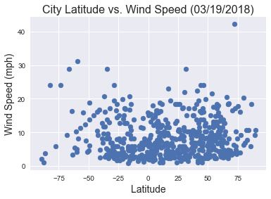

```python
print("Analysis:")
print("")
print("Observed Trend 1: Temperatures are highest near the equator and decrease as you proceed towards the poles")
print("Observed Trend 2: The north pole is colder than the south pole. Probably because we are currently in the northern winter")
print("Observed Trend 3: It is least windy at the equator")
      
```

    Analysis:
    
    Observed Trend 1: Temperatures are highest near the equator and decrease as you proceed towards the poles
    Observed Trend 2: The north pole is colder than the south pole. Probably because we are currently in the northern winter
    Observed Trend 3: It is least windy at the equator
    


```python
# Dependencies
import pandas as pd
import numpy as np
import requests
import json
from citipy import citipy
import csv
import matplotlib.pyplot as plt
import seaborn as sns
import datetime
from openweathermap import APIKEY
import pprint
```


```python
# Generate quantity of random locations (1500, empirically determined) sufficient to yield 500 unique weather stations
Latitude = np.random.uniform(-90, 90, size=1500)
Longtitude = np.random.uniform(-180, 180, size=1500)
```


```python
Location = {"Latitude": Latitude, "Longitude": Longtitude}
Location_df = pd.DataFrame(Location)
Location_df.head()
```


<div>
<style>
    .dataframe thead tr:only-child th {
        text-align: right;
    }

    .dataframe thead th {
        text-align: left;
    }

    .dataframe tbody tr th {
        vertical-align: top;
    }
</style>
<table border="1" class="dataframe">
  <thead>
    <tr style="text-align: right;">
      <th></th>
      <th>Latitude</th>
      <th>Longitude</th>
    </tr>
  </thead>
  <tbody>
    <tr>
      <th>0</th>
      <td>29.842742</td>
      <td>128.342468</td>
    </tr>
    <tr>
      <th>1</th>
      <td>10.931421</td>
      <td>105.420889</td>
    </tr>
    <tr>
      <th>2</th>
      <td>-33.042394</td>
      <td>-8.754730</td>
    </tr>
    <tr>
      <th>3</th>
      <td>-54.887563</td>
      <td>-121.086507</td>
    </tr>
    <tr>
      <th>4</th>
      <td>35.971666</td>
      <td>-6.453644</td>
    </tr>
  </tbody>
</table>
</div>


```python
for index, row in Location_df.iterrows():
    city = citipy.nearest_city(row["Latitude"], row["Longitude"]).city_name
    country = citipy.nearest_city(row["Latitude"], row["Longitude"]).country_code
    Location_df.set_value(index, "City", city)
    Location_df.set_value(index, "Country", country)
len(Location_df)

```


    1500


```python
Location_df.head()
```


<div>
<style>
    .dataframe thead tr:only-child th {
        text-align: right;
    }

    .dataframe thead th {
        text-align: left;
    }

    .dataframe tbody tr th {
        vertical-align: top;
    }
</style>
<table border="1" class="dataframe">
  <thead>
    <tr style="text-align: right;">
      <th></th>
      <th>Latitude</th>
      <th>Longitude</th>
      <th>City</th>
      <th>Country</th>
    </tr>
  </thead>
  <tbody>
    <tr>
      <th>0</th>
      <td>29.842742</td>
      <td>128.342468</td>
      <td>naze</td>
      <td>jp</td>
    </tr>
    <tr>
      <th>1</th>
      <td>10.931421</td>
      <td>105.420889</td>
      <td>chau doc</td>
      <td>vn</td>
    </tr>
    <tr>
      <th>2</th>
      <td>-33.042394</td>
      <td>-8.754730</td>
      <td>jamestown</td>
      <td>sh</td>
    </tr>
    <tr>
      <th>3</th>
      <td>-54.887563</td>
      <td>-121.086507</td>
      <td>rikitea</td>
      <td>pf</td>
    </tr>
    <tr>
      <th>4</th>
      <td>35.971666</td>
      <td>-6.453644</td>
      <td>conil</td>
      <td>es</td>
    </tr>
  </tbody>
</table>
</div>


```python
Location_df.drop_duplicates(subset=["City","Country"], inplace=True)
#Location_df.info()
len(Location_df)
#Location_df.head()
```


    596


```python
Location_df.head() 
```


<div>
<style>
    .dataframe thead tr:only-child th {
        text-align: right;
    }

    .dataframe thead th {
        text-align: left;
    }

    .dataframe tbody tr th {
        vertical-align: top;
    }
</style>
<table border="1" class="dataframe">
  <thead>
    <tr style="text-align: right;">
      <th></th>
      <th>Latitude</th>
      <th>Longitude</th>
      <th>City</th>
      <th>Country</th>
    </tr>
  </thead>
  <tbody>
    <tr>
      <th>0</th>
      <td>29.842742</td>
      <td>128.342468</td>
      <td>naze</td>
      <td>jp</td>
    </tr>
    <tr>
      <th>1</th>
      <td>10.931421</td>
      <td>105.420889</td>
      <td>chau doc</td>
      <td>vn</td>
    </tr>
    <tr>
      <th>2</th>
      <td>-33.042394</td>
      <td>-8.754730</td>
      <td>jamestown</td>
      <td>sh</td>
    </tr>
    <tr>
      <th>3</th>
      <td>-54.887563</td>
      <td>-121.086507</td>
      <td>rikitea</td>
      <td>pf</td>
    </tr>
    <tr>
      <th>4</th>
      <td>35.971666</td>
      <td>-6.453644</td>
      <td>conil</td>
      <td>es</td>
    </tr>
  </tbody>
</table>
</div>


```python
url = "http://api.openweathermap.org/data/2.5/weather?"
units = "imperial"
print(str(url))
```

    http://api.openweathermap.org/data/2.5/weather?
    


```python
counter = 0
for index, rows in Location_df.iterrows():
    RequestURL = url + "appid=" + APIKEY + "&units=" + units + "&q=" + (rows["City"])
    Response = requests.get(RequestURL).json()
    try:
        Location_df.set_value(index, "Max Temp", Response["main"]["temp_max"])
        Location_df.set_value(index, "Humidity", Response["main"]["humidity"])
        Location_df.set_value(index, "Wind Speed", Response["wind"]["speed"])   
        Location_df.set_value(index, "Cloudiness", Response["clouds"]["all"])
        
        counter = counter + 1
        print ("Processing Record: ", counter, " of Set 1 |" , Response["name"])
        print (RequestURL)  
    except:
        continue
    #print(json.dumps(Response, indent=4, sort_keys=True))

```

    Processing Record:  1  of Set 1 | Naze
    http://api.openweathermap.org/data/2.5/weather?appid=95cca715ee032b80d55ce5180e93a46c&units=imperial&q=naze
    Processing Record:  2  of Set 1 | Chau Doc
    http://api.openweathermap.org/data/2.5/weather?appid=95cca715ee032b80d55ce5180e93a46c&units=imperial&q=chau doc
    Processing Record:  3  of Set 1 | Jamestown
    http://api.openweathermap.org/data/2.5/weather?appid=95cca715ee032b80d55ce5180e93a46c&units=imperial&q=jamestown
    Processing Record:  4  of Set 1 | Rikitea
    http://api.openweathermap.org/data/2.5/weather?appid=95cca715ee032b80d55ce5180e93a46c&units=imperial&q=rikitea
    Processing Record:  5  of Set 1 | Conil
    http://api.openweathermap.org/data/2.5/weather?appid=95cca715ee032b80d55ce5180e93a46c&units=imperial&q=conil
    Processing Record:  6  of Set 1 | Kaitangata
    http://api.openweathermap.org/data/2.5/weather?appid=95cca715ee032b80d55ce5180e93a46c&units=imperial&q=kaitangata
    Processing Record:  7  of Set 1 | Abalak
    http://api.openweathermap.org/data/2.5/weather?appid=95cca715ee032b80d55ce5180e93a46c&units=imperial&q=abalak
    Processing Record:  8  of Set 1 | Talnakh
    http://api.openweathermap.org/data/2.5/weather?appid=95cca715ee032b80d55ce5180e93a46c&units=imperial&q=talnakh
    Processing Record:  9  of Set 1 | Hay River
    http://api.openweathermap.org/data/2.5/weather?appid=95cca715ee032b80d55ce5180e93a46c&units=imperial&q=hay river
    Processing Record:  10  of Set 1 | Mataura
    http://api.openweathermap.org/data/2.5/weather?appid=95cca715ee032b80d55ce5180e93a46c&units=imperial&q=mataura
    Processing Record:  11  of Set 1 | Norman Wells
    http://api.openweathermap.org/data/2.5/weather?appid=95cca715ee032b80d55ce5180e93a46c&units=imperial&q=norman wells
    Processing Record:  12  of Set 1 | Lorengau
    http://api.openweathermap.org/data/2.5/weather?appid=95cca715ee032b80d55ce5180e93a46c&units=imperial&q=lorengau
    Processing Record:  13  of Set 1 | Salalah
    http://api.openweathermap.org/data/2.5/weather?appid=95cca715ee032b80d55ce5180e93a46c&units=imperial&q=salalah
    Processing Record:  14  of Set 1 | Provideniya
    http://api.openweathermap.org/data/2.5/weather?appid=95cca715ee032b80d55ce5180e93a46c&units=imperial&q=provideniya
    Processing Record:  15  of Set 1 | Longyearbyen
    http://api.openweathermap.org/data/2.5/weather?appid=95cca715ee032b80d55ce5180e93a46c&units=imperial&q=longyearbyen
    Processing Record:  16  of Set 1 | Atuona
    http://api.openweathermap.org/data/2.5/weather?appid=95cca715ee032b80d55ce5180e93a46c&units=imperial&q=atuona
    Processing Record:  17  of Set 1 | Kodiak
    http://api.openweathermap.org/data/2.5/weather?appid=95cca715ee032b80d55ce5180e93a46c&units=imperial&q=kodiak
    Processing Record:  18  of Set 1 | Punta Arenas
    http://api.openweathermap.org/data/2.5/weather?appid=95cca715ee032b80d55ce5180e93a46c&units=imperial&q=punta arenas
    Processing Record:  19  of Set 1 | Son La
    http://api.openweathermap.org/data/2.5/weather?appid=95cca715ee032b80d55ce5180e93a46c&units=imperial&q=son la
    Processing Record:  20  of Set 1 | Geraldton
    http://api.openweathermap.org/data/2.5/weather?appid=95cca715ee032b80d55ce5180e93a46c&units=imperial&q=geraldton
    Processing Record:  21  of Set 1 | Lompoc
    http://api.openweathermap.org/data/2.5/weather?appid=95cca715ee032b80d55ce5180e93a46c&units=imperial&q=lompoc
    Processing Record:  22  of Set 1 | Nome
    http://api.openweathermap.org/data/2.5/weather?appid=95cca715ee032b80d55ce5180e93a46c&units=imperial&q=nome
    Processing Record:  23  of Set 1 | New Norfolk
    http://api.openweathermap.org/data/2.5/weather?appid=95cca715ee032b80d55ce5180e93a46c&units=imperial&q=new norfolk
    Processing Record:  24  of Set 1 | Pervomayskiy
    http://api.openweathermap.org/data/2.5/weather?appid=95cca715ee032b80d55ce5180e93a46c&units=imperial&q=pervomayskiy
    Processing Record:  25  of Set 1 | Hasaki
    http://api.openweathermap.org/data/2.5/weather?appid=95cca715ee032b80d55ce5180e93a46c&units=imperial&q=hasaki
    Processing Record:  26  of Set 1 | Fortuna
    http://api.openweathermap.org/data/2.5/weather?appid=95cca715ee032b80d55ce5180e93a46c&units=imperial&q=fortuna
    Processing Record:  27  of Set 1 | Kapaa
    http://api.openweathermap.org/data/2.5/weather?appid=95cca715ee032b80d55ce5180e93a46c&units=imperial&q=kapaa
    Processing Record:  28  of Set 1 | Ushuaia
    http://api.openweathermap.org/data/2.5/weather?appid=95cca715ee032b80d55ce5180e93a46c&units=imperial&q=ushuaia
    Processing Record:  29  of Set 1 | East London
    http://api.openweathermap.org/data/2.5/weather?appid=95cca715ee032b80d55ce5180e93a46c&units=imperial&q=east london
    Processing Record:  30  of Set 1 | Saint-Joseph
    http://api.openweathermap.org/data/2.5/weather?appid=95cca715ee032b80d55ce5180e93a46c&units=imperial&q=saint-joseph
    Processing Record:  31  of Set 1 | Cairns
    http://api.openweathermap.org/data/2.5/weather?appid=95cca715ee032b80d55ce5180e93a46c&units=imperial&q=cairns
    Processing Record:  32  of Set 1 | Tuktoyaktuk
    http://api.openweathermap.org/data/2.5/weather?appid=95cca715ee032b80d55ce5180e93a46c&units=imperial&q=tuktoyaktuk
    Processing Record:  33  of Set 1 | Saint-Pierre
    http://api.openweathermap.org/data/2.5/weather?appid=95cca715ee032b80d55ce5180e93a46c&units=imperial&q=saint-pierre
    Processing Record:  34  of Set 1 | Flinders
    http://api.openweathermap.org/data/2.5/weather?appid=95cca715ee032b80d55ce5180e93a46c&units=imperial&q=flinders
    Processing Record:  35  of Set 1 | Owando
    http://api.openweathermap.org/data/2.5/weather?appid=95cca715ee032b80d55ce5180e93a46c&units=imperial&q=owando
    Processing Record:  36  of Set 1 | Vila Franca do Campo
    http://api.openweathermap.org/data/2.5/weather?appid=95cca715ee032b80d55ce5180e93a46c&units=imperial&q=vila franca do campo
    Processing Record:  37  of Set 1 | Panacan
    http://api.openweathermap.org/data/2.5/weather?appid=95cca715ee032b80d55ce5180e93a46c&units=imperial&q=panacan
    Processing Record:  38  of Set 1 | Ahipara
    http://api.openweathermap.org/data/2.5/weather?appid=95cca715ee032b80d55ce5180e93a46c&units=imperial&q=ahipara
    Processing Record:  39  of Set 1 | Tecoanapa
    http://api.openweathermap.org/data/2.5/weather?appid=95cca715ee032b80d55ce5180e93a46c&units=imperial&q=tecoanapa
    Processing Record:  40  of Set 1 | San Policarpo
    http://api.openweathermap.org/data/2.5/weather?appid=95cca715ee032b80d55ce5180e93a46c&units=imperial&q=san policarpo
    Processing Record:  41  of Set 1 | Cabo San Lucas
    http://api.openweathermap.org/data/2.5/weather?appid=95cca715ee032b80d55ce5180e93a46c&units=imperial&q=cabo san lucas
    Processing Record:  42  of Set 1 | Umba
    http://api.openweathermap.org/data/2.5/weather?appid=95cca715ee032b80d55ce5180e93a46c&units=imperial&q=umba
    Processing Record:  43  of Set 1 | Seddon
    http://api.openweathermap.org/data/2.5/weather?appid=95cca715ee032b80d55ce5180e93a46c&units=imperial&q=seddon
    Processing Record:  44  of Set 1 | Avarua
    http://api.openweathermap.org/data/2.5/weather?appid=95cca715ee032b80d55ce5180e93a46c&units=imperial&q=avarua
    Processing Record:  45  of Set 1 | Cutler Ridge
    http://api.openweathermap.org/data/2.5/weather?appid=95cca715ee032b80d55ce5180e93a46c&units=imperial&q=cutler ridge
    Processing Record:  46  of Set 1 | Eyl
    http://api.openweathermap.org/data/2.5/weather?appid=95cca715ee032b80d55ce5180e93a46c&units=imperial&q=eyl
    Processing Record:  47  of Set 1 | Beatrice
    http://api.openweathermap.org/data/2.5/weather?appid=95cca715ee032b80d55ce5180e93a46c&units=imperial&q=beatrice
    Processing Record:  48  of Set 1 | Cape Town
    http://api.openweathermap.org/data/2.5/weather?appid=95cca715ee032b80d55ce5180e93a46c&units=imperial&q=cape town
    Processing Record:  49  of Set 1 | Dikson
    http://api.openweathermap.org/data/2.5/weather?appid=95cca715ee032b80d55ce5180e93a46c&units=imperial&q=dikson
    Processing Record:  50  of Set 1 | Shingu
    http://api.openweathermap.org/data/2.5/weather?appid=95cca715ee032b80d55ce5180e93a46c&units=imperial&q=shingu
    Processing Record:  51  of Set 1 | Thompson
    http://api.openweathermap.org/data/2.5/weather?appid=95cca715ee032b80d55ce5180e93a46c&units=imperial&q=thompson
    Processing Record:  52  of Set 1 | Samarai
    http://api.openweathermap.org/data/2.5/weather?appid=95cca715ee032b80d55ce5180e93a46c&units=imperial&q=samarai
    Processing Record:  53  of Set 1 | Yellowknife
    http://api.openweathermap.org/data/2.5/weather?appid=95cca715ee032b80d55ce5180e93a46c&units=imperial&q=yellowknife
    Processing Record:  54  of Set 1 | Saldanha
    http://api.openweathermap.org/data/2.5/weather?appid=95cca715ee032b80d55ce5180e93a46c&units=imperial&q=saldanha
    Processing Record:  55  of Set 1 | Whitehorse
    http://api.openweathermap.org/data/2.5/weather?appid=95cca715ee032b80d55ce5180e93a46c&units=imperial&q=whitehorse
    Processing Record:  56  of Set 1 | Sijunjung
    http://api.openweathermap.org/data/2.5/weather?appid=95cca715ee032b80d55ce5180e93a46c&units=imperial&q=sijunjung
    Processing Record:  57  of Set 1 | Butaritari
    http://api.openweathermap.org/data/2.5/weather?appid=95cca715ee032b80d55ce5180e93a46c&units=imperial&q=butaritari
    Processing Record:  58  of Set 1 | Albany
    http://api.openweathermap.org/data/2.5/weather?appid=95cca715ee032b80d55ce5180e93a46c&units=imperial&q=albany
    Processing Record:  59  of Set 1 | Lebu
    http://api.openweathermap.org/data/2.5/weather?appid=95cca715ee032b80d55ce5180e93a46c&units=imperial&q=lebu
    Processing Record:  60  of Set 1 | College
    http://api.openweathermap.org/data/2.5/weather?appid=95cca715ee032b80d55ce5180e93a46c&units=imperial&q=college
    Processing Record:  61  of Set 1 | Ciudad Bolivar
    http://api.openweathermap.org/data/2.5/weather?appid=95cca715ee032b80d55ce5180e93a46c&units=imperial&q=ciudad bolivar
    Processing Record:  62  of Set 1 | Ponta do Sol
    http://api.openweathermap.org/data/2.5/weather?appid=95cca715ee032b80d55ce5180e93a46c&units=imperial&q=ponta do sol
    Processing Record:  63  of Set 1 | Bredasdorp
    http://api.openweathermap.org/data/2.5/weather?appid=95cca715ee032b80d55ce5180e93a46c&units=imperial&q=bredasdorp
    Processing Record:  64  of Set 1 | Northam
    http://api.openweathermap.org/data/2.5/weather?appid=95cca715ee032b80d55ce5180e93a46c&units=imperial&q=northam
    Processing Record:  65  of Set 1 | Barrow
    http://api.openweathermap.org/data/2.5/weather?appid=95cca715ee032b80d55ce5180e93a46c&units=imperial&q=barrow
    Processing Record:  66  of Set 1 | Iqaluit
    http://api.openweathermap.org/data/2.5/weather?appid=95cca715ee032b80d55ce5180e93a46c&units=imperial&q=iqaluit
    Processing Record:  67  of Set 1 | Sisimiut
    http://api.openweathermap.org/data/2.5/weather?appid=95cca715ee032b80d55ce5180e93a46c&units=imperial&q=sisimiut
    Processing Record:  68  of Set 1 | Saskylakh
    http://api.openweathermap.org/data/2.5/weather?appid=95cca715ee032b80d55ce5180e93a46c&units=imperial&q=saskylakh
    Processing Record:  69  of Set 1 | Nikolskoye
    http://api.openweathermap.org/data/2.5/weather?appid=95cca715ee032b80d55ce5180e93a46c&units=imperial&q=nikolskoye
    Processing Record:  70  of Set 1 | Maniitsoq
    http://api.openweathermap.org/data/2.5/weather?appid=95cca715ee032b80d55ce5180e93a46c&units=imperial&q=maniitsoq
    Processing Record:  71  of Set 1 | Busselton
    http://api.openweathermap.org/data/2.5/weather?appid=95cca715ee032b80d55ce5180e93a46c&units=imperial&q=busselton
    Processing Record:  72  of Set 1 | Port Elizabeth
    http://api.openweathermap.org/data/2.5/weather?appid=95cca715ee032b80d55ce5180e93a46c&units=imperial&q=port elizabeth
    Processing Record:  73  of Set 1 | Kanniyakumari
    http://api.openweathermap.org/data/2.5/weather?appid=95cca715ee032b80d55ce5180e93a46c&units=imperial&q=kanniyakumari
    Processing Record:  74  of Set 1 | Castro
    http://api.openweathermap.org/data/2.5/weather?appid=95cca715ee032b80d55ce5180e93a46c&units=imperial&q=castro
    Processing Record:  75  of Set 1 | San Patricio
    http://api.openweathermap.org/data/2.5/weather?appid=95cca715ee032b80d55ce5180e93a46c&units=imperial&q=san patricio
    Processing Record:  76  of Set 1 | Arraial do Cabo
    http://api.openweathermap.org/data/2.5/weather?appid=95cca715ee032b80d55ce5180e93a46c&units=imperial&q=arraial do cabo
    Processing Record:  77  of Set 1 | Kenai
    http://api.openweathermap.org/data/2.5/weather?appid=95cca715ee032b80d55ce5180e93a46c&units=imperial&q=kenai
    Processing Record:  78  of Set 1 | San Jeronimo
    http://api.openweathermap.org/data/2.5/weather?appid=95cca715ee032b80d55ce5180e93a46c&units=imperial&q=san jeronimo
    Processing Record:  79  of Set 1 | Qaanaaq
    http://api.openweathermap.org/data/2.5/weather?appid=95cca715ee032b80d55ce5180e93a46c&units=imperial&q=qaanaaq
    Processing Record:  80  of Set 1 | Majene
    http://api.openweathermap.org/data/2.5/weather?appid=95cca715ee032b80d55ce5180e93a46c&units=imperial&q=majene
    Processing Record:  81  of Set 1 | Port Alfred
    http://api.openweathermap.org/data/2.5/weather?appid=95cca715ee032b80d55ce5180e93a46c&units=imperial&q=port alfred
    Processing Record:  82  of Set 1 | Avera
    http://api.openweathermap.org/data/2.5/weather?appid=95cca715ee032b80d55ce5180e93a46c&units=imperial&q=avera
    Processing Record:  83  of Set 1 | Giresun
    http://api.openweathermap.org/data/2.5/weather?appid=95cca715ee032b80d55ce5180e93a46c&units=imperial&q=giresun
    Processing Record:  84  of Set 1 | Mar del Plata
    http://api.openweathermap.org/data/2.5/weather?appid=95cca715ee032b80d55ce5180e93a46c&units=imperial&q=mar del plata
    Processing Record:  85  of Set 1 | Airai
    http://api.openweathermap.org/data/2.5/weather?appid=95cca715ee032b80d55ce5180e93a46c&units=imperial&q=airai
    Processing Record:  86  of Set 1 | Kikwit
    http://api.openweathermap.org/data/2.5/weather?appid=95cca715ee032b80d55ce5180e93a46c&units=imperial&q=kikwit
    Processing Record:  87  of Set 1 | Kedrovyy
    http://api.openweathermap.org/data/2.5/weather?appid=95cca715ee032b80d55ce5180e93a46c&units=imperial&q=kedrovyy
    Processing Record:  88  of Set 1 | Vaini
    http://api.openweathermap.org/data/2.5/weather?appid=95cca715ee032b80d55ce5180e93a46c&units=imperial&q=vaini
    Processing Record:  89  of Set 1 | Qaqortoq
    http://api.openweathermap.org/data/2.5/weather?appid=95cca715ee032b80d55ce5180e93a46c&units=imperial&q=qaqortoq
    Processing Record:  90  of Set 1 | Bilma
    http://api.openweathermap.org/data/2.5/weather?appid=95cca715ee032b80d55ce5180e93a46c&units=imperial&q=bilma
    Processing Record:  91  of Set 1 | Severo-Kurilsk
    http://api.openweathermap.org/data/2.5/weather?appid=95cca715ee032b80d55ce5180e93a46c&units=imperial&q=severo-kurilsk
    Processing Record:  92  of Set 1 | Podgornoye
    http://api.openweathermap.org/data/2.5/weather?appid=95cca715ee032b80d55ce5180e93a46c&units=imperial&q=podgornoye
    Processing Record:  93  of Set 1 | Pangkalanbuun
    http://api.openweathermap.org/data/2.5/weather?appid=95cca715ee032b80d55ce5180e93a46c&units=imperial&q=pangkalanbuun
    Processing Record:  94  of Set 1 | Krasnyy Chikoy
    http://api.openweathermap.org/data/2.5/weather?appid=95cca715ee032b80d55ce5180e93a46c&units=imperial&q=krasnyy chikoy
    Processing Record:  95  of Set 1 | Angren
    http://api.openweathermap.org/data/2.5/weather?appid=95cca715ee032b80d55ce5180e93a46c&units=imperial&q=angren
    Processing Record:  96  of Set 1 | Hermanus
    http://api.openweathermap.org/data/2.5/weather?appid=95cca715ee032b80d55ce5180e93a46c&units=imperial&q=hermanus
    Processing Record:  97  of Set 1 | Jijiang
    http://api.openweathermap.org/data/2.5/weather?appid=95cca715ee032b80d55ce5180e93a46c&units=imperial&q=jijiang
    Processing Record:  98  of Set 1 | Fairview
    http://api.openweathermap.org/data/2.5/weather?appid=95cca715ee032b80d55ce5180e93a46c&units=imperial&q=fairview
    Processing Record:  99  of Set 1 | Ribeira Grande
    http://api.openweathermap.org/data/2.5/weather?appid=95cca715ee032b80d55ce5180e93a46c&units=imperial&q=ribeira grande
    Processing Record:  100  of Set 1 | Ploemeur
    http://api.openweathermap.org/data/2.5/weather?appid=95cca715ee032b80d55ce5180e93a46c&units=imperial&q=ploemeur
    Processing Record:  101  of Set 1 | Tiksi
    http://api.openweathermap.org/data/2.5/weather?appid=95cca715ee032b80d55ce5180e93a46c&units=imperial&q=tiksi
    Processing Record:  102  of Set 1 | Griffith
    http://api.openweathermap.org/data/2.5/weather?appid=95cca715ee032b80d55ce5180e93a46c&units=imperial&q=griffith
    Processing Record:  103  of Set 1 | Haines Junction
    http://api.openweathermap.org/data/2.5/weather?appid=95cca715ee032b80d55ce5180e93a46c&units=imperial&q=haines junction
    Processing Record:  104  of Set 1 | Lac-Megantic
    http://api.openweathermap.org/data/2.5/weather?appid=95cca715ee032b80d55ce5180e93a46c&units=imperial&q=lac-megantic
    Processing Record:  105  of Set 1 | Cayenne
    http://api.openweathermap.org/data/2.5/weather?appid=95cca715ee032b80d55ce5180e93a46c&units=imperial&q=cayenne
    Processing Record:  106  of Set 1 | Chuy
    http://api.openweathermap.org/data/2.5/weather?appid=95cca715ee032b80d55ce5180e93a46c&units=imperial&q=chuy
    Processing Record:  107  of Set 1 | Kruisfontein
    http://api.openweathermap.org/data/2.5/weather?appid=95cca715ee032b80d55ce5180e93a46c&units=imperial&q=kruisfontein
    Processing Record:  108  of Set 1 | Ketchikan
    http://api.openweathermap.org/data/2.5/weather?appid=95cca715ee032b80d55ce5180e93a46c&units=imperial&q=ketchikan
    Processing Record:  109  of Set 1 | Coquimbo
    http://api.openweathermap.org/data/2.5/weather?appid=95cca715ee032b80d55ce5180e93a46c&units=imperial&q=coquimbo
    Processing Record:  110  of Set 1 | Adrar
    http://api.openweathermap.org/data/2.5/weather?appid=95cca715ee032b80d55ce5180e93a46c&units=imperial&q=adrar
    Processing Record:  111  of Set 1 | Mehamn
    http://api.openweathermap.org/data/2.5/weather?appid=95cca715ee032b80d55ce5180e93a46c&units=imperial&q=mehamn
    Processing Record:  112  of Set 1 | Bonavista
    http://api.openweathermap.org/data/2.5/weather?appid=95cca715ee032b80d55ce5180e93a46c&units=imperial&q=bonavista
    Processing Record:  113  of Set 1 | Warwick
    http://api.openweathermap.org/data/2.5/weather?appid=95cca715ee032b80d55ce5180e93a46c&units=imperial&q=warwick
    Processing Record:  114  of Set 1 | Udayagiri
    http://api.openweathermap.org/data/2.5/weather?appid=95cca715ee032b80d55ce5180e93a46c&units=imperial&q=udayagiri
    Processing Record:  115  of Set 1 | Alice Springs
    http://api.openweathermap.org/data/2.5/weather?appid=95cca715ee032b80d55ce5180e93a46c&units=imperial&q=alice springs
    Processing Record:  116  of Set 1 | Bocanda
    http://api.openweathermap.org/data/2.5/weather?appid=95cca715ee032b80d55ce5180e93a46c&units=imperial&q=bocanda
    Processing Record:  117  of Set 1 | Ayutla
    http://api.openweathermap.org/data/2.5/weather?appid=95cca715ee032b80d55ce5180e93a46c&units=imperial&q=ayutla
    Processing Record:  118  of Set 1 | Cacador
    http://api.openweathermap.org/data/2.5/weather?appid=95cca715ee032b80d55ce5180e93a46c&units=imperial&q=cacador
    Processing Record:  119  of Set 1 | Mantua
    http://api.openweathermap.org/data/2.5/weather?appid=95cca715ee032b80d55ce5180e93a46c&units=imperial&q=mantua
    Processing Record:  120  of Set 1 | Binga
    http://api.openweathermap.org/data/2.5/weather?appid=95cca715ee032b80d55ce5180e93a46c&units=imperial&q=binga
    Processing Record:  121  of Set 1 | Atar
    http://api.openweathermap.org/data/2.5/weather?appid=95cca715ee032b80d55ce5180e93a46c&units=imperial&q=atar
    Processing Record:  122  of Set 1 | Yulara
    http://api.openweathermap.org/data/2.5/weather?appid=95cca715ee032b80d55ce5180e93a46c&units=imperial&q=yulara
    Processing Record:  123  of Set 1 | Pangnirtung
    http://api.openweathermap.org/data/2.5/weather?appid=95cca715ee032b80d55ce5180e93a46c&units=imperial&q=pangnirtung
    Processing Record:  124  of Set 1 | Clyde River
    http://api.openweathermap.org/data/2.5/weather?appid=95cca715ee032b80d55ce5180e93a46c&units=imperial&q=clyde river
    Processing Record:  125  of Set 1 | Hithadhoo
    http://api.openweathermap.org/data/2.5/weather?appid=95cca715ee032b80d55ce5180e93a46c&units=imperial&q=hithadhoo
    Processing Record:  126  of Set 1 | Orvieto
    http://api.openweathermap.org/data/2.5/weather?appid=95cca715ee032b80d55ce5180e93a46c&units=imperial&q=orvieto
    Processing Record:  127  of Set 1 | Kununurra
    http://api.openweathermap.org/data/2.5/weather?appid=95cca715ee032b80d55ce5180e93a46c&units=imperial&q=kununurra
    Processing Record:  128  of Set 1 | Carballo
    http://api.openweathermap.org/data/2.5/weather?appid=95cca715ee032b80d55ce5180e93a46c&units=imperial&q=carballo
    Processing Record:  129  of Set 1 | Mount Gambier
    http://api.openweathermap.org/data/2.5/weather?appid=95cca715ee032b80d55ce5180e93a46c&units=imperial&q=mount gambier
    Processing Record:  130  of Set 1 | Nago
    http://api.openweathermap.org/data/2.5/weather?appid=95cca715ee032b80d55ce5180e93a46c&units=imperial&q=nago
    Processing Record:  131  of Set 1 | Suraabad
    http://api.openweathermap.org/data/2.5/weather?appid=95cca715ee032b80d55ce5180e93a46c&units=imperial&q=suraabad
    Processing Record:  132  of Set 1 | Shenjiamen
    http://api.openweathermap.org/data/2.5/weather?appid=95cca715ee032b80d55ce5180e93a46c&units=imperial&q=shenjiamen
    Processing Record:  133  of Set 1 | Bethel
    http://api.openweathermap.org/data/2.5/weather?appid=95cca715ee032b80d55ce5180e93a46c&units=imperial&q=bethel
    Processing Record:  134  of Set 1 | Prieska
    http://api.openweathermap.org/data/2.5/weather?appid=95cca715ee032b80d55ce5180e93a46c&units=imperial&q=prieska
    Processing Record:  135  of Set 1 | Sirjan
    http://api.openweathermap.org/data/2.5/weather?appid=95cca715ee032b80d55ce5180e93a46c&units=imperial&q=sirjan
    Processing Record:  136  of Set 1 | Okakarara
    http://api.openweathermap.org/data/2.5/weather?appid=95cca715ee032b80d55ce5180e93a46c&units=imperial&q=okakarara
    Processing Record:  137  of Set 1 | Chokurdakh
    http://api.openweathermap.org/data/2.5/weather?appid=95cca715ee032b80d55ce5180e93a46c&units=imperial&q=chokurdakh
    Processing Record:  138  of Set 1 | Hamilton
    http://api.openweathermap.org/data/2.5/weather?appid=95cca715ee032b80d55ce5180e93a46c&units=imperial&q=hamilton
    Processing Record:  139  of Set 1 | Batagay-Alyta
    http://api.openweathermap.org/data/2.5/weather?appid=95cca715ee032b80d55ce5180e93a46c&units=imperial&q=batagay-alyta
    Processing Record:  140  of Set 1 | Luwuk
    http://api.openweathermap.org/data/2.5/weather?appid=95cca715ee032b80d55ce5180e93a46c&units=imperial&q=luwuk
    Processing Record:  141  of Set 1 | Moindou
    http://api.openweathermap.org/data/2.5/weather?appid=95cca715ee032b80d55ce5180e93a46c&units=imperial&q=moindou
    Processing Record:  142  of Set 1 | Hobart
    http://api.openweathermap.org/data/2.5/weather?appid=95cca715ee032b80d55ce5180e93a46c&units=imperial&q=hobart
    Processing Record:  143  of Set 1 | Hambantota
    http://api.openweathermap.org/data/2.5/weather?appid=95cca715ee032b80d55ce5180e93a46c&units=imperial&q=hambantota
    Processing Record:  144  of Set 1 | Los Llanos de Aridane
    http://api.openweathermap.org/data/2.5/weather?appid=95cca715ee032b80d55ce5180e93a46c&units=imperial&q=los llanos de aridane
    Processing Record:  145  of Set 1 | Ampanihy
    http://api.openweathermap.org/data/2.5/weather?appid=95cca715ee032b80d55ce5180e93a46c&units=imperial&q=ampanihy
    Processing Record:  146  of Set 1 | Esperance
    http://api.openweathermap.org/data/2.5/weather?appid=95cca715ee032b80d55ce5180e93a46c&units=imperial&q=esperance
    Processing Record:  147  of Set 1 | Fort Nelson
    http://api.openweathermap.org/data/2.5/weather?appid=95cca715ee032b80d55ce5180e93a46c&units=imperial&q=fort nelson
    Processing Record:  148  of Set 1 | Hovd
    http://api.openweathermap.org/data/2.5/weather?appid=95cca715ee032b80d55ce5180e93a46c&units=imperial&q=hovd
    Processing Record:  149  of Set 1 | Bluff
    http://api.openweathermap.org/data/2.5/weather?appid=95cca715ee032b80d55ce5180e93a46c&units=imperial&q=bluff
    Processing Record:  150  of Set 1 | Tuatapere
    http://api.openweathermap.org/data/2.5/weather?appid=95cca715ee032b80d55ce5180e93a46c&units=imperial&q=tuatapere
    Processing Record:  151  of Set 1 | Grand Gaube
    http://api.openweathermap.org/data/2.5/weather?appid=95cca715ee032b80d55ce5180e93a46c&units=imperial&q=grand gaube
    Processing Record:  152  of Set 1 | High Rock
    http://api.openweathermap.org/data/2.5/weather?appid=95cca715ee032b80d55ce5180e93a46c&units=imperial&q=high rock
    Processing Record:  153  of Set 1 | Ometepec
    http://api.openweathermap.org/data/2.5/weather?appid=95cca715ee032b80d55ce5180e93a46c&units=imperial&q=ometepec
    Processing Record:  154  of Set 1 | Half Moon Bay
    http://api.openweathermap.org/data/2.5/weather?appid=95cca715ee032b80d55ce5180e93a46c&units=imperial&q=half moon bay
    Processing Record:  155  of Set 1 | Jacareacanga
    http://api.openweathermap.org/data/2.5/weather?appid=95cca715ee032b80d55ce5180e93a46c&units=imperial&q=jacareacanga
    Processing Record:  156  of Set 1 | Necochea
    http://api.openweathermap.org/data/2.5/weather?appid=95cca715ee032b80d55ce5180e93a46c&units=imperial&q=necochea
    Processing Record:  157  of Set 1 | Chilliwack
    http://api.openweathermap.org/data/2.5/weather?appid=95cca715ee032b80d55ce5180e93a46c&units=imperial&q=chilliwack
    Processing Record:  158  of Set 1 | Carnarvon
    http://api.openweathermap.org/data/2.5/weather?appid=95cca715ee032b80d55ce5180e93a46c&units=imperial&q=carnarvon
    Processing Record:  159  of Set 1 | Georgetown
    http://api.openweathermap.org/data/2.5/weather?appid=95cca715ee032b80d55ce5180e93a46c&units=imperial&q=georgetown
    Processing Record:  160  of Set 1 | Richards Bay
    http://api.openweathermap.org/data/2.5/weather?appid=95cca715ee032b80d55ce5180e93a46c&units=imperial&q=richards bay
    Processing Record:  161  of Set 1 | Sao Filipe
    http://api.openweathermap.org/data/2.5/weather?appid=95cca715ee032b80d55ce5180e93a46c&units=imperial&q=sao filipe
    Processing Record:  162  of Set 1 | Torbay
    http://api.openweathermap.org/data/2.5/weather?appid=95cca715ee032b80d55ce5180e93a46c&units=imperial&q=torbay
    Processing Record:  163  of Set 1 | Port Hardy
    http://api.openweathermap.org/data/2.5/weather?appid=95cca715ee032b80d55ce5180e93a46c&units=imperial&q=port hardy
    Processing Record:  164  of Set 1 | Port Augusta
    http://api.openweathermap.org/data/2.5/weather?appid=95cca715ee032b80d55ce5180e93a46c&units=imperial&q=port augusta
    Processing Record:  165  of Set 1 | Ostrovnoy
    http://api.openweathermap.org/data/2.5/weather?appid=95cca715ee032b80d55ce5180e93a46c&units=imperial&q=ostrovnoy
    Processing Record:  166  of Set 1 | Narsaq
    http://api.openweathermap.org/data/2.5/weather?appid=95cca715ee032b80d55ce5180e93a46c&units=imperial&q=narsaq
    Processing Record:  167  of Set 1 | Oliveira
    http://api.openweathermap.org/data/2.5/weather?appid=95cca715ee032b80d55ce5180e93a46c&units=imperial&q=oliveira
    Processing Record:  168  of Set 1 | Dingle
    http://api.openweathermap.org/data/2.5/weather?appid=95cca715ee032b80d55ce5180e93a46c&units=imperial&q=dingle
    Processing Record:  169  of Set 1 | Muscat
    http://api.openweathermap.org/data/2.5/weather?appid=95cca715ee032b80d55ce5180e93a46c&units=imperial&q=muscat
    Processing Record:  170  of Set 1 | Hofn
    http://api.openweathermap.org/data/2.5/weather?appid=95cca715ee032b80d55ce5180e93a46c&units=imperial&q=hofn
    Processing Record:  171  of Set 1 | Ambulu
    http://api.openweathermap.org/data/2.5/weather?appid=95cca715ee032b80d55ce5180e93a46c&units=imperial&q=ambulu
    Processing Record:  172  of Set 1 | Panjakent
    http://api.openweathermap.org/data/2.5/weather?appid=95cca715ee032b80d55ce5180e93a46c&units=imperial&q=panjakent
    Processing Record:  173  of Set 1 | Jalu
    http://api.openweathermap.org/data/2.5/weather?appid=95cca715ee032b80d55ce5180e93a46c&units=imperial&q=jalu
    Processing Record:  174  of Set 1 | Paciran
    http://api.openweathermap.org/data/2.5/weather?appid=95cca715ee032b80d55ce5180e93a46c&units=imperial&q=paciran
    Processing Record:  175  of Set 1 | Leh
    http://api.openweathermap.org/data/2.5/weather?appid=95cca715ee032b80d55ce5180e93a46c&units=imperial&q=leh
    Processing Record:  176  of Set 1 | Pimentel
    http://api.openweathermap.org/data/2.5/weather?appid=95cca715ee032b80d55ce5180e93a46c&units=imperial&q=pimentel
    Processing Record:  177  of Set 1 | Bambous Virieux
    http://api.openweathermap.org/data/2.5/weather?appid=95cca715ee032b80d55ce5180e93a46c&units=imperial&q=bambous virieux
    Processing Record:  178  of Set 1 | Cortez
    http://api.openweathermap.org/data/2.5/weather?appid=95cca715ee032b80d55ce5180e93a46c&units=imperial&q=cortez
    Processing Record:  179  of Set 1 | Saint Anthony
    http://api.openweathermap.org/data/2.5/weather?appid=95cca715ee032b80d55ce5180e93a46c&units=imperial&q=saint anthony
    Processing Record:  180  of Set 1 | Havoysund
    http://api.openweathermap.org/data/2.5/weather?appid=95cca715ee032b80d55ce5180e93a46c&units=imperial&q=havoysund
    Processing Record:  181  of Set 1 | Christchurch
    http://api.openweathermap.org/data/2.5/weather?appid=95cca715ee032b80d55ce5180e93a46c&units=imperial&q=christchurch
    Processing Record:  182  of Set 1 | Port Blair
    http://api.openweathermap.org/data/2.5/weather?appid=95cca715ee032b80d55ce5180e93a46c&units=imperial&q=port blair
    Processing Record:  183  of Set 1 | Talara
    http://api.openweathermap.org/data/2.5/weather?appid=95cca715ee032b80d55ce5180e93a46c&units=imperial&q=talara
    Processing Record:  184  of Set 1 | Alakurtti
    http://api.openweathermap.org/data/2.5/weather?appid=95cca715ee032b80d55ce5180e93a46c&units=imperial&q=alakurtti
    Processing Record:  185  of Set 1 | Broome
    http://api.openweathermap.org/data/2.5/weather?appid=95cca715ee032b80d55ce5180e93a46c&units=imperial&q=broome
    Processing Record:  186  of Set 1 | Shieli
    http://api.openweathermap.org/data/2.5/weather?appid=95cca715ee032b80d55ce5180e93a46c&units=imperial&q=shieli
    Processing Record:  187  of Set 1 | Tura
    http://api.openweathermap.org/data/2.5/weather?appid=95cca715ee032b80d55ce5180e93a46c&units=imperial&q=tura
    Processing Record:  188  of Set 1 | Bud
    http://api.openweathermap.org/data/2.5/weather?appid=95cca715ee032b80d55ce5180e93a46c&units=imperial&q=bud
    Processing Record:  189  of Set 1 | Debre Sina
    http://api.openweathermap.org/data/2.5/weather?appid=95cca715ee032b80d55ce5180e93a46c&units=imperial&q=debre sina
    Processing Record:  190  of Set 1 | Tallahassee
    http://api.openweathermap.org/data/2.5/weather?appid=95cca715ee032b80d55ce5180e93a46c&units=imperial&q=tallahassee
    Processing Record:  191  of Set 1 | San Quintin
    http://api.openweathermap.org/data/2.5/weather?appid=95cca715ee032b80d55ce5180e93a46c&units=imperial&q=san quintin
    Processing Record:  192  of Set 1 | Mayo
    http://api.openweathermap.org/data/2.5/weather?appid=95cca715ee032b80d55ce5180e93a46c&units=imperial&q=mayo
    Processing Record:  193  of Set 1 | Waipawa
    http://api.openweathermap.org/data/2.5/weather?appid=95cca715ee032b80d55ce5180e93a46c&units=imperial&q=waipawa
    Processing Record:  194  of Set 1 | Wattegama
    http://api.openweathermap.org/data/2.5/weather?appid=95cca715ee032b80d55ce5180e93a46c&units=imperial&q=wattegama
    Processing Record:  195  of Set 1 | San Rafael
    http://api.openweathermap.org/data/2.5/weather?appid=95cca715ee032b80d55ce5180e93a46c&units=imperial&q=san rafael
    Processing Record:  196  of Set 1 | Padang
    http://api.openweathermap.org/data/2.5/weather?appid=95cca715ee032b80d55ce5180e93a46c&units=imperial&q=padang
    Processing Record:  197  of Set 1 | Wanning
    http://api.openweathermap.org/data/2.5/weather?appid=95cca715ee032b80d55ce5180e93a46c&units=imperial&q=wanning
    Processing Record:  198  of Set 1 | Tasiilaq
    http://api.openweathermap.org/data/2.5/weather?appid=95cca715ee032b80d55ce5180e93a46c&units=imperial&q=tasiilaq
    Processing Record:  199  of Set 1 | Saint-Philippe
    http://api.openweathermap.org/data/2.5/weather?appid=95cca715ee032b80d55ce5180e93a46c&units=imperial&q=saint-philippe
    Processing Record:  200  of Set 1 | Fallon
    http://api.openweathermap.org/data/2.5/weather?appid=95cca715ee032b80d55ce5180e93a46c&units=imperial&q=fallon
    Processing Record:  201  of Set 1 | Zyryanka
    http://api.openweathermap.org/data/2.5/weather?appid=95cca715ee032b80d55ce5180e93a46c&units=imperial&q=zyryanka
    Processing Record:  202  of Set 1 | Scottsbluff
    http://api.openweathermap.org/data/2.5/weather?appid=95cca715ee032b80d55ce5180e93a46c&units=imperial&q=scottsbluff
    Processing Record:  203  of Set 1 | Awbari
    http://api.openweathermap.org/data/2.5/weather?appid=95cca715ee032b80d55ce5180e93a46c&units=imperial&q=awbari
    Processing Record:  204  of Set 1 | Puerto Escondido
    http://api.openweathermap.org/data/2.5/weather?appid=95cca715ee032b80d55ce5180e93a46c&units=imperial&q=puerto escondido
    Processing Record:  205  of Set 1 | Zemio
    http://api.openweathermap.org/data/2.5/weather?appid=95cca715ee032b80d55ce5180e93a46c&units=imperial&q=zemio
    Processing Record:  206  of Set 1 | Husavik
    http://api.openweathermap.org/data/2.5/weather?appid=95cca715ee032b80d55ce5180e93a46c&units=imperial&q=husavik
    Processing Record:  207  of Set 1 | Pouembout
    http://api.openweathermap.org/data/2.5/weather?appid=95cca715ee032b80d55ce5180e93a46c&units=imperial&q=pouembout
    Processing Record:  208  of Set 1 | Nakapiripirit
    http://api.openweathermap.org/data/2.5/weather?appid=95cca715ee032b80d55ce5180e93a46c&units=imperial&q=nakapiripirit
    Processing Record:  209  of Set 1 | Katherine
    http://api.openweathermap.org/data/2.5/weather?appid=95cca715ee032b80d55ce5180e93a46c&units=imperial&q=katherine
    Processing Record:  210  of Set 1 | Vryburg
    http://api.openweathermap.org/data/2.5/weather?appid=95cca715ee032b80d55ce5180e93a46c&units=imperial&q=vryburg
    Processing Record:  211  of Set 1 | Beringovskiy
    http://api.openweathermap.org/data/2.5/weather?appid=95cca715ee032b80d55ce5180e93a46c&units=imperial&q=beringovskiy
    Processing Record:  212  of Set 1 | Kieta
    http://api.openweathermap.org/data/2.5/weather?appid=95cca715ee032b80d55ce5180e93a46c&units=imperial&q=kieta
    Processing Record:  213  of Set 1 | San Vicente
    http://api.openweathermap.org/data/2.5/weather?appid=95cca715ee032b80d55ce5180e93a46c&units=imperial&q=san vicente
    Processing Record:  214  of Set 1 | Touros
    http://api.openweathermap.org/data/2.5/weather?appid=95cca715ee032b80d55ce5180e93a46c&units=imperial&q=touros
    Processing Record:  215  of Set 1 | Kavieng
    http://api.openweathermap.org/data/2.5/weather?appid=95cca715ee032b80d55ce5180e93a46c&units=imperial&q=kavieng
    Processing Record:  216  of Set 1 | Gizo
    http://api.openweathermap.org/data/2.5/weather?appid=95cca715ee032b80d55ce5180e93a46c&units=imperial&q=gizo
    Processing Record:  217  of Set 1 | Bertoua
    http://api.openweathermap.org/data/2.5/weather?appid=95cca715ee032b80d55ce5180e93a46c&units=imperial&q=bertoua
    Processing Record:  218  of Set 1 | Geraldton
    http://api.openweathermap.org/data/2.5/weather?appid=95cca715ee032b80d55ce5180e93a46c&units=imperial&q=geraldton
    Processing Record:  219  of Set 1 | Hilo
    http://api.openweathermap.org/data/2.5/weather?appid=95cca715ee032b80d55ce5180e93a46c&units=imperial&q=hilo
    Processing Record:  220  of Set 1 | Senanga
    http://api.openweathermap.org/data/2.5/weather?appid=95cca715ee032b80d55ce5180e93a46c&units=imperial&q=senanga
    Processing Record:  221  of Set 1 | Sabang
    http://api.openweathermap.org/data/2.5/weather?appid=95cca715ee032b80d55ce5180e93a46c&units=imperial&q=sabang
    Processing Record:  222  of Set 1 | Menongue
    http://api.openweathermap.org/data/2.5/weather?appid=95cca715ee032b80d55ce5180e93a46c&units=imperial&q=menongue
    Processing Record:  223  of Set 1 | Qasigiannguit
    http://api.openweathermap.org/data/2.5/weather?appid=95cca715ee032b80d55ce5180e93a46c&units=imperial&q=qasigiannguit
    Processing Record:  224  of Set 1 | Solhan
    http://api.openweathermap.org/data/2.5/weather?appid=95cca715ee032b80d55ce5180e93a46c&units=imperial&q=solhan
    Processing Record:  225  of Set 1 | Egvekinot
    http://api.openweathermap.org/data/2.5/weather?appid=95cca715ee032b80d55ce5180e93a46c&units=imperial&q=egvekinot
    Processing Record:  226  of Set 1 | Anadyr
    http://api.openweathermap.org/data/2.5/weather?appid=95cca715ee032b80d55ce5180e93a46c&units=imperial&q=anadyr
    Processing Record:  227  of Set 1 | Dodge City
    http://api.openweathermap.org/data/2.5/weather?appid=95cca715ee032b80d55ce5180e93a46c&units=imperial&q=dodge city
    Processing Record:  228  of Set 1 | Camacha
    http://api.openweathermap.org/data/2.5/weather?appid=95cca715ee032b80d55ce5180e93a46c&units=imperial&q=camacha
    Processing Record:  229  of Set 1 | Namatanai
    http://api.openweathermap.org/data/2.5/weather?appid=95cca715ee032b80d55ce5180e93a46c&units=imperial&q=namatanai
    Processing Record:  230  of Set 1 | Quimper
    http://api.openweathermap.org/data/2.5/weather?appid=95cca715ee032b80d55ce5180e93a46c&units=imperial&q=quimper
    Processing Record:  231  of Set 1 | Nanortalik
    http://api.openweathermap.org/data/2.5/weather?appid=95cca715ee032b80d55ce5180e93a46c&units=imperial&q=nanortalik
    Processing Record:  232  of Set 1 | Visby
    http://api.openweathermap.org/data/2.5/weather?appid=95cca715ee032b80d55ce5180e93a46c&units=imperial&q=visby
    Processing Record:  233  of Set 1 | Pevek
    http://api.openweathermap.org/data/2.5/weather?appid=95cca715ee032b80d55ce5180e93a46c&units=imperial&q=pevek
    Processing Record:  234  of Set 1 | Saint-Augustin
    http://api.openweathermap.org/data/2.5/weather?appid=95cca715ee032b80d55ce5180e93a46c&units=imperial&q=saint-augustin
    Processing Record:  235  of Set 1 | Souillac
    http://api.openweathermap.org/data/2.5/weather?appid=95cca715ee032b80d55ce5180e93a46c&units=imperial&q=souillac
    Processing Record:  236  of Set 1 | Puerto Cabezas
    http://api.openweathermap.org/data/2.5/weather?appid=95cca715ee032b80d55ce5180e93a46c&units=imperial&q=puerto cabezas
    Processing Record:  237  of Set 1 | Jurilovca
    http://api.openweathermap.org/data/2.5/weather?appid=95cca715ee032b80d55ce5180e93a46c&units=imperial&q=jurilovca
    Processing Record:  238  of Set 1 | Mahebourg
    http://api.openweathermap.org/data/2.5/weather?appid=95cca715ee032b80d55ce5180e93a46c&units=imperial&q=mahebourg
    Processing Record:  239  of Set 1 | Marienburg
    http://api.openweathermap.org/data/2.5/weather?appid=95cca715ee032b80d55ce5180e93a46c&units=imperial&q=marienburg
    Processing Record:  240  of Set 1 | Banda Aceh
    http://api.openweathermap.org/data/2.5/weather?appid=95cca715ee032b80d55ce5180e93a46c&units=imperial&q=banda aceh
    Processing Record:  241  of Set 1 | Lata
    http://api.openweathermap.org/data/2.5/weather?appid=95cca715ee032b80d55ce5180e93a46c&units=imperial&q=lata
    Processing Record:  242  of Set 1 | Kahului
    http://api.openweathermap.org/data/2.5/weather?appid=95cca715ee032b80d55ce5180e93a46c&units=imperial&q=kahului
    Processing Record:  243  of Set 1 | Springdale
    http://api.openweathermap.org/data/2.5/weather?appid=95cca715ee032b80d55ce5180e93a46c&units=imperial&q=springdale
    Processing Record:  244  of Set 1 | Kutum
    http://api.openweathermap.org/data/2.5/weather?appid=95cca715ee032b80d55ce5180e93a46c&units=imperial&q=kutum
    Processing Record:  245  of Set 1 | Bulaevo
    http://api.openweathermap.org/data/2.5/weather?appid=95cca715ee032b80d55ce5180e93a46c&units=imperial&q=bulaevo
    Processing Record:  246  of Set 1 | Hobyo
    http://api.openweathermap.org/data/2.5/weather?appid=95cca715ee032b80d55ce5180e93a46c&units=imperial&q=hobyo
    Processing Record:  247  of Set 1 | Devarkonda
    http://api.openweathermap.org/data/2.5/weather?appid=95cca715ee032b80d55ce5180e93a46c&units=imperial&q=devarkonda
    Processing Record:  248  of Set 1 | Betanzos
    http://api.openweathermap.org/data/2.5/weather?appid=95cca715ee032b80d55ce5180e93a46c&units=imperial&q=betanzos
    Processing Record:  249  of Set 1 | San Luis
    http://api.openweathermap.org/data/2.5/weather?appid=95cca715ee032b80d55ce5180e93a46c&units=imperial&q=san luis
    Processing Record:  250  of Set 1 | Kalmunai
    http://api.openweathermap.org/data/2.5/weather?appid=95cca715ee032b80d55ce5180e93a46c&units=imperial&q=kalmunai
    Processing Record:  251  of Set 1 | Banfora
    http://api.openweathermap.org/data/2.5/weather?appid=95cca715ee032b80d55ce5180e93a46c&units=imperial&q=banfora
    Processing Record:  252  of Set 1 | Saint-Louis
    http://api.openweathermap.org/data/2.5/weather?appid=95cca715ee032b80d55ce5180e93a46c&units=imperial&q=saint-louis
    Processing Record:  253  of Set 1 | North Bend
    http://api.openweathermap.org/data/2.5/weather?appid=95cca715ee032b80d55ce5180e93a46c&units=imperial&q=north bend
    Processing Record:  254  of Set 1 | Manokwari
    http://api.openweathermap.org/data/2.5/weather?appid=95cca715ee032b80d55ce5180e93a46c&units=imperial&q=manokwari
    Processing Record:  255  of Set 1 | Mago
    http://api.openweathermap.org/data/2.5/weather?appid=95cca715ee032b80d55ce5180e93a46c&units=imperial&q=mago
    Processing Record:  256  of Set 1 | Codrington
    http://api.openweathermap.org/data/2.5/weather?appid=95cca715ee032b80d55ce5180e93a46c&units=imperial&q=codrington
    Processing Record:  257  of Set 1 | Vestmannaeyjar
    http://api.openweathermap.org/data/2.5/weather?appid=95cca715ee032b80d55ce5180e93a46c&units=imperial&q=vestmannaeyjar
    Processing Record:  258  of Set 1 | Kaiserslautern
    http://api.openweathermap.org/data/2.5/weather?appid=95cca715ee032b80d55ce5180e93a46c&units=imperial&q=kaiserslautern
    Processing Record:  259  of Set 1 | Upernavik
    http://api.openweathermap.org/data/2.5/weather?appid=95cca715ee032b80d55ce5180e93a46c&units=imperial&q=upernavik
    Processing Record:  260  of Set 1 | Quatre Cocos
    http://api.openweathermap.org/data/2.5/weather?appid=95cca715ee032b80d55ce5180e93a46c&units=imperial&q=quatre cocos
    Processing Record:  261  of Set 1 | Meulaboh
    http://api.openweathermap.org/data/2.5/weather?appid=95cca715ee032b80d55ce5180e93a46c&units=imperial&q=meulaboh
    Processing Record:  262  of Set 1 | Shimsk
    http://api.openweathermap.org/data/2.5/weather?appid=95cca715ee032b80d55ce5180e93a46c&units=imperial&q=shimsk
    Processing Record:  263  of Set 1 | Khatanga
    http://api.openweathermap.org/data/2.5/weather?appid=95cca715ee032b80d55ce5180e93a46c&units=imperial&q=khatanga
    Processing Record:  264  of Set 1 | Victoria
    http://api.openweathermap.org/data/2.5/weather?appid=95cca715ee032b80d55ce5180e93a46c&units=imperial&q=victoria
    Processing Record:  265  of Set 1 | French Harbor
    http://api.openweathermap.org/data/2.5/weather?appid=95cca715ee032b80d55ce5180e93a46c&units=imperial&q=french harbor
    Processing Record:  266  of Set 1 | Benxi
    http://api.openweathermap.org/data/2.5/weather?appid=95cca715ee032b80d55ce5180e93a46c&units=imperial&q=benxi
    Processing Record:  267  of Set 1 | Petropavlovsk-Kamchatskiy
    http://api.openweathermap.org/data/2.5/weather?appid=95cca715ee032b80d55ce5180e93a46c&units=imperial&q=petropavlovsk-kamchatskiy
    Processing Record:  268  of Set 1 | Mahajanga
    http://api.openweathermap.org/data/2.5/weather?appid=95cca715ee032b80d55ce5180e93a46c&units=imperial&q=mahajanga
    Processing Record:  269  of Set 1 | San-Pedro
    http://api.openweathermap.org/data/2.5/weather?appid=95cca715ee032b80d55ce5180e93a46c&units=imperial&q=san-pedro
    Processing Record:  270  of Set 1 | Sembakung
    http://api.openweathermap.org/data/2.5/weather?appid=95cca715ee032b80d55ce5180e93a46c&units=imperial&q=sembakung
    Processing Record:  271  of Set 1 | Panguipulli
    http://api.openweathermap.org/data/2.5/weather?appid=95cca715ee032b80d55ce5180e93a46c&units=imperial&q=panguipulli
    Processing Record:  272  of Set 1 | Santa Maria
    http://api.openweathermap.org/data/2.5/weather?appid=95cca715ee032b80d55ce5180e93a46c&units=imperial&q=santa maria
    Processing Record:  273  of Set 1 | Bembereke
    http://api.openweathermap.org/data/2.5/weather?appid=95cca715ee032b80d55ce5180e93a46c&units=imperial&q=bembereke
    Processing Record:  274  of Set 1 | Jinka
    http://api.openweathermap.org/data/2.5/weather?appid=95cca715ee032b80d55ce5180e93a46c&units=imperial&q=jinka
    Processing Record:  275  of Set 1 | Tessalit
    http://api.openweathermap.org/data/2.5/weather?appid=95cca715ee032b80d55ce5180e93a46c&units=imperial&q=tessalit
    Processing Record:  276  of Set 1 | Kudahuvadhoo
    http://api.openweathermap.org/data/2.5/weather?appid=95cca715ee032b80d55ce5180e93a46c&units=imperial&q=kudahuvadhoo
    Processing Record:  277  of Set 1 | Mackay
    http://api.openweathermap.org/data/2.5/weather?appid=95cca715ee032b80d55ce5180e93a46c&units=imperial&q=mackay
    Processing Record:  278  of Set 1 | Beira
    http://api.openweathermap.org/data/2.5/weather?appid=95cca715ee032b80d55ce5180e93a46c&units=imperial&q=beira
    Processing Record:  279  of Set 1 | Sinnamary
    http://api.openweathermap.org/data/2.5/weather?appid=95cca715ee032b80d55ce5180e93a46c&units=imperial&q=sinnamary
    Processing Record:  280  of Set 1 | Arman
    http://api.openweathermap.org/data/2.5/weather?appid=95cca715ee032b80d55ce5180e93a46c&units=imperial&q=arman
    Processing Record:  281  of Set 1 | Lethem
    http://api.openweathermap.org/data/2.5/weather?appid=95cca715ee032b80d55ce5180e93a46c&units=imperial&q=lethem
    Processing Record:  282  of Set 1 | Iisalmi
    http://api.openweathermap.org/data/2.5/weather?appid=95cca715ee032b80d55ce5180e93a46c&units=imperial&q=iisalmi
    Processing Record:  283  of Set 1 | Maldonado
    http://api.openweathermap.org/data/2.5/weather?appid=95cca715ee032b80d55ce5180e93a46c&units=imperial&q=maldonado
    Processing Record:  284  of Set 1 | Puerto Ayora
    http://api.openweathermap.org/data/2.5/weather?appid=95cca715ee032b80d55ce5180e93a46c&units=imperial&q=puerto ayora
    Processing Record:  285  of Set 1 | Yaan
    http://api.openweathermap.org/data/2.5/weather?appid=95cca715ee032b80d55ce5180e93a46c&units=imperial&q=yaan
    Processing Record:  286  of Set 1 | Nishihara
    http://api.openweathermap.org/data/2.5/weather?appid=95cca715ee032b80d55ce5180e93a46c&units=imperial&q=nishihara
    Processing Record:  287  of Set 1 | Namibe
    http://api.openweathermap.org/data/2.5/weather?appid=95cca715ee032b80d55ce5180e93a46c&units=imperial&q=namibe
    Processing Record:  288  of Set 1 | Sao Joao da Barra
    http://api.openweathermap.org/data/2.5/weather?appid=95cca715ee032b80d55ce5180e93a46c&units=imperial&q=sao joao da barra
    Processing Record:  289  of Set 1 | Colares
    http://api.openweathermap.org/data/2.5/weather?appid=95cca715ee032b80d55ce5180e93a46c&units=imperial&q=colares
    Processing Record:  290  of Set 1 | Xichang
    http://api.openweathermap.org/data/2.5/weather?appid=95cca715ee032b80d55ce5180e93a46c&units=imperial&q=xichang
    Processing Record:  291  of Set 1 | Yefremov
    http://api.openweathermap.org/data/2.5/weather?appid=95cca715ee032b80d55ce5180e93a46c&units=imperial&q=yefremov
    Processing Record:  292  of Set 1 | Buchloe
    http://api.openweathermap.org/data/2.5/weather?appid=95cca715ee032b80d55ce5180e93a46c&units=imperial&q=buchloe
    Processing Record:  293  of Set 1 | Sovetskoye
    http://api.openweathermap.org/data/2.5/weather?appid=95cca715ee032b80d55ce5180e93a46c&units=imperial&q=sovetskoye
    Processing Record:  294  of Set 1 | Bubaque
    http://api.openweathermap.org/data/2.5/weather?appid=95cca715ee032b80d55ce5180e93a46c&units=imperial&q=bubaque
    Processing Record:  295  of Set 1 | Honiara
    http://api.openweathermap.org/data/2.5/weather?appid=95cca715ee032b80d55ce5180e93a46c&units=imperial&q=honiara
    Processing Record:  296  of Set 1 | Areosa
    http://api.openweathermap.org/data/2.5/weather?appid=95cca715ee032b80d55ce5180e93a46c&units=imperial&q=areosa
    Processing Record:  297  of Set 1 | Kavaratti
    http://api.openweathermap.org/data/2.5/weather?appid=95cca715ee032b80d55ce5180e93a46c&units=imperial&q=kavaratti
    Processing Record:  298  of Set 1 | Kalininsk
    http://api.openweathermap.org/data/2.5/weather?appid=95cca715ee032b80d55ce5180e93a46c&units=imperial&q=kalininsk
    Processing Record:  299  of Set 1 | Jingdezhen
    http://api.openweathermap.org/data/2.5/weather?appid=95cca715ee032b80d55ce5180e93a46c&units=imperial&q=jingdezhen
    Processing Record:  300  of Set 1 | Rocha
    http://api.openweathermap.org/data/2.5/weather?appid=95cca715ee032b80d55ce5180e93a46c&units=imperial&q=rocha
    Processing Record:  301  of Set 1 | Fairbanks
    http://api.openweathermap.org/data/2.5/weather?appid=95cca715ee032b80d55ce5180e93a46c&units=imperial&q=fairbanks
    Processing Record:  302  of Set 1 | Yumen
    http://api.openweathermap.org/data/2.5/weather?appid=95cca715ee032b80d55ce5180e93a46c&units=imperial&q=yumen
    Processing Record:  303  of Set 1 | Pisco
    http://api.openweathermap.org/data/2.5/weather?appid=95cca715ee032b80d55ce5180e93a46c&units=imperial&q=pisco
    Processing Record:  304  of Set 1 | Great Yarmouth
    http://api.openweathermap.org/data/2.5/weather?appid=95cca715ee032b80d55ce5180e93a46c&units=imperial&q=great yarmouth
    Processing Record:  305  of Set 1 | Port Keats
    http://api.openweathermap.org/data/2.5/weather?appid=95cca715ee032b80d55ce5180e93a46c&units=imperial&q=port keats
    Processing Record:  306  of Set 1 | Franca
    http://api.openweathermap.org/data/2.5/weather?appid=95cca715ee032b80d55ce5180e93a46c&units=imperial&q=franca
    Processing Record:  307  of Set 1 | Soyo
    http://api.openweathermap.org/data/2.5/weather?appid=95cca715ee032b80d55ce5180e93a46c&units=imperial&q=soyo
    Processing Record:  308  of Set 1 | Ribeirao Pires
    http://api.openweathermap.org/data/2.5/weather?appid=95cca715ee032b80d55ce5180e93a46c&units=imperial&q=ribeirao pires
    Processing Record:  309  of Set 1 | Ishim
    http://api.openweathermap.org/data/2.5/weather?appid=95cca715ee032b80d55ce5180e93a46c&units=imperial&q=ishim
    Processing Record:  310  of Set 1 | Palimbang
    http://api.openweathermap.org/data/2.5/weather?appid=95cca715ee032b80d55ce5180e93a46c&units=imperial&q=palimbang
    Processing Record:  311  of Set 1 | Vangaindrano
    http://api.openweathermap.org/data/2.5/weather?appid=95cca715ee032b80d55ce5180e93a46c&units=imperial&q=vangaindrano
    Processing Record:  312  of Set 1 | Vardo
    http://api.openweathermap.org/data/2.5/weather?appid=95cca715ee032b80d55ce5180e93a46c&units=imperial&q=vardo
    Processing Record:  313  of Set 1 | Pipri
    http://api.openweathermap.org/data/2.5/weather?appid=95cca715ee032b80d55ce5180e93a46c&units=imperial&q=pipri
    Processing Record:  314  of Set 1 | Deming
    http://api.openweathermap.org/data/2.5/weather?appid=95cca715ee032b80d55ce5180e93a46c&units=imperial&q=deming
    Processing Record:  315  of Set 1 | Turukhansk
    http://api.openweathermap.org/data/2.5/weather?appid=95cca715ee032b80d55ce5180e93a46c&units=imperial&q=turukhansk
    Processing Record:  316  of Set 1 | Brits
    http://api.openweathermap.org/data/2.5/weather?appid=95cca715ee032b80d55ce5180e93a46c&units=imperial&q=brits
    Processing Record:  317  of Set 1 | Nicoya
    http://api.openweathermap.org/data/2.5/weather?appid=95cca715ee032b80d55ce5180e93a46c&units=imperial&q=nicoya
    Processing Record:  318  of Set 1 | Karratha
    http://api.openweathermap.org/data/2.5/weather?appid=95cca715ee032b80d55ce5180e93a46c&units=imperial&q=karratha
    Processing Record:  319  of Set 1 | Vao
    http://api.openweathermap.org/data/2.5/weather?appid=95cca715ee032b80d55ce5180e93a46c&units=imperial&q=vao
    Processing Record:  320  of Set 1 | Zaraza
    http://api.openweathermap.org/data/2.5/weather?appid=95cca715ee032b80d55ce5180e93a46c&units=imperial&q=zaraza
    Processing Record:  321  of Set 1 | Vicksburg
    http://api.openweathermap.org/data/2.5/weather?appid=95cca715ee032b80d55ce5180e93a46c&units=imperial&q=vicksburg
    Processing Record:  322  of Set 1 | Kagadi
    http://api.openweathermap.org/data/2.5/weather?appid=95cca715ee032b80d55ce5180e93a46c&units=imperial&q=kagadi
    Processing Record:  323  of Set 1 | Bathsheba
    http://api.openweathermap.org/data/2.5/weather?appid=95cca715ee032b80d55ce5180e93a46c&units=imperial&q=bathsheba
    Processing Record:  324  of Set 1 | Harper
    http://api.openweathermap.org/data/2.5/weather?appid=95cca715ee032b80d55ce5180e93a46c&units=imperial&q=harper
    Processing Record:  325  of Set 1 | Leshukonskoye
    http://api.openweathermap.org/data/2.5/weather?appid=95cca715ee032b80d55ce5180e93a46c&units=imperial&q=leshukonskoye
    Processing Record:  326  of Set 1 | Kamyshlov
    http://api.openweathermap.org/data/2.5/weather?appid=95cca715ee032b80d55ce5180e93a46c&units=imperial&q=kamyshlov
    Processing Record:  327  of Set 1 | Boueni
    http://api.openweathermap.org/data/2.5/weather?appid=95cca715ee032b80d55ce5180e93a46c&units=imperial&q=boueni
    Processing Record:  328  of Set 1 | Den Helder
    http://api.openweathermap.org/data/2.5/weather?appid=95cca715ee032b80d55ce5180e93a46c&units=imperial&q=den helder
    Processing Record:  329  of Set 1 | Okhotsk
    http://api.openweathermap.org/data/2.5/weather?appid=95cca715ee032b80d55ce5180e93a46c&units=imperial&q=okhotsk
    Processing Record:  330  of Set 1 | Portree
    http://api.openweathermap.org/data/2.5/weather?appid=95cca715ee032b80d55ce5180e93a46c&units=imperial&q=portree
    Processing Record:  331  of Set 1 | Kysyl-Syr
    http://api.openweathermap.org/data/2.5/weather?appid=95cca715ee032b80d55ce5180e93a46c&units=imperial&q=kysyl-syr
    Processing Record:  332  of Set 1 | Shitanjing
    http://api.openweathermap.org/data/2.5/weather?appid=95cca715ee032b80d55ce5180e93a46c&units=imperial&q=shitanjing
    Processing Record:  333  of Set 1 | Biltine
    http://api.openweathermap.org/data/2.5/weather?appid=95cca715ee032b80d55ce5180e93a46c&units=imperial&q=biltine
    Processing Record:  334  of Set 1 | Ukiah
    http://api.openweathermap.org/data/2.5/weather?appid=95cca715ee032b80d55ce5180e93a46c&units=imperial&q=ukiah
    Processing Record:  335  of Set 1 | Puerto Colombia
    http://api.openweathermap.org/data/2.5/weather?appid=95cca715ee032b80d55ce5180e93a46c&units=imperial&q=puerto colombia
    Processing Record:  336  of Set 1 | Tautira
    http://api.openweathermap.org/data/2.5/weather?appid=95cca715ee032b80d55ce5180e93a46c&units=imperial&q=tautira
    Processing Record:  337  of Set 1 | Gaoua
    http://api.openweathermap.org/data/2.5/weather?appid=95cca715ee032b80d55ce5180e93a46c&units=imperial&q=gaoua
    Processing Record:  338  of Set 1 | Barreiras
    http://api.openweathermap.org/data/2.5/weather?appid=95cca715ee032b80d55ce5180e93a46c&units=imperial&q=barreiras
    Processing Record:  339  of Set 1 | Konevo
    http://api.openweathermap.org/data/2.5/weather?appid=95cca715ee032b80d55ce5180e93a46c&units=imperial&q=konevo
    Processing Record:  340  of Set 1 | Makungu
    http://api.openweathermap.org/data/2.5/weather?appid=95cca715ee032b80d55ce5180e93a46c&units=imperial&q=makungu
    Processing Record:  341  of Set 1 | Glyadyanskoye
    http://api.openweathermap.org/data/2.5/weather?appid=95cca715ee032b80d55ce5180e93a46c&units=imperial&q=glyadyanskoye
    Processing Record:  342  of Set 1 | Atikokan
    http://api.openweathermap.org/data/2.5/weather?appid=95cca715ee032b80d55ce5180e93a46c&units=imperial&q=atikokan
    Processing Record:  343  of Set 1 | Kambove
    http://api.openweathermap.org/data/2.5/weather?appid=95cca715ee032b80d55ce5180e93a46c&units=imperial&q=kambove
    Processing Record:  344  of Set 1 | Cherskiy
    http://api.openweathermap.org/data/2.5/weather?appid=95cca715ee032b80d55ce5180e93a46c&units=imperial&q=cherskiy
    Processing Record:  345  of Set 1 | Mogadishu
    http://api.openweathermap.org/data/2.5/weather?appid=95cca715ee032b80d55ce5180e93a46c&units=imperial&q=mogadishu
    Processing Record:  346  of Set 1 | Bokajan
    http://api.openweathermap.org/data/2.5/weather?appid=95cca715ee032b80d55ce5180e93a46c&units=imperial&q=bokajan
    Processing Record:  347  of Set 1 | Leningradskiy
    http://api.openweathermap.org/data/2.5/weather?appid=95cca715ee032b80d55ce5180e93a46c&units=imperial&q=leningradskiy
    Processing Record:  348  of Set 1 | Havelock
    http://api.openweathermap.org/data/2.5/weather?appid=95cca715ee032b80d55ce5180e93a46c&units=imperial&q=havelock
    Processing Record:  349  of Set 1 | Constitucion
    http://api.openweathermap.org/data/2.5/weather?appid=95cca715ee032b80d55ce5180e93a46c&units=imperial&q=constitucion
    Processing Record:  350  of Set 1 | Xingyi
    http://api.openweathermap.org/data/2.5/weather?appid=95cca715ee032b80d55ce5180e93a46c&units=imperial&q=xingyi
    Processing Record:  351  of Set 1 | Fethiye
    http://api.openweathermap.org/data/2.5/weather?appid=95cca715ee032b80d55ce5180e93a46c&units=imperial&q=fethiye
    Processing Record:  352  of Set 1 | Vila Velha
    http://api.openweathermap.org/data/2.5/weather?appid=95cca715ee032b80d55ce5180e93a46c&units=imperial&q=vila velha
    Processing Record:  353  of Set 1 | Jogeva
    http://api.openweathermap.org/data/2.5/weather?appid=95cca715ee032b80d55ce5180e93a46c&units=imperial&q=jogeva
    Processing Record:  354  of Set 1 | Goderich
    http://api.openweathermap.org/data/2.5/weather?appid=95cca715ee032b80d55ce5180e93a46c&units=imperial&q=goderich
    Processing Record:  355  of Set 1 | San Francisco
    http://api.openweathermap.org/data/2.5/weather?appid=95cca715ee032b80d55ce5180e93a46c&units=imperial&q=san francisco
    Processing Record:  356  of Set 1 | Inhambane
    http://api.openweathermap.org/data/2.5/weather?appid=95cca715ee032b80d55ce5180e93a46c&units=imperial&q=inhambane
    Processing Record:  357  of Set 1 | Goundam
    http://api.openweathermap.org/data/2.5/weather?appid=95cca715ee032b80d55ce5180e93a46c&units=imperial&q=goundam
    Processing Record:  358  of Set 1 | Shache
    http://api.openweathermap.org/data/2.5/weather?appid=95cca715ee032b80d55ce5180e93a46c&units=imperial&q=shache
    Processing Record:  359  of Set 1 | Chemal
    http://api.openweathermap.org/data/2.5/weather?appid=95cca715ee032b80d55ce5180e93a46c&units=imperial&q=chemal
    Processing Record:  360  of Set 1 | Mitsamiouli
    http://api.openweathermap.org/data/2.5/weather?appid=95cca715ee032b80d55ce5180e93a46c&units=imperial&q=mitsamiouli
    Processing Record:  361  of Set 1 | Riachao
    http://api.openweathermap.org/data/2.5/weather?appid=95cca715ee032b80d55ce5180e93a46c&units=imperial&q=riachao
    Processing Record:  362  of Set 1 | Nizhniy Kuranakh
    http://api.openweathermap.org/data/2.5/weather?appid=95cca715ee032b80d55ce5180e93a46c&units=imperial&q=nizhniy kuranakh
    Processing Record:  363  of Set 1 | Kathmandu
    http://api.openweathermap.org/data/2.5/weather?appid=95cca715ee032b80d55ce5180e93a46c&units=imperial&q=kathmandu
    Processing Record:  364  of Set 1 | Deputatskiy
    http://api.openweathermap.org/data/2.5/weather?appid=95cca715ee032b80d55ce5180e93a46c&units=imperial&q=deputatskiy
    Processing Record:  365  of Set 1 | Anajatuba
    http://api.openweathermap.org/data/2.5/weather?appid=95cca715ee032b80d55ce5180e93a46c&units=imperial&q=anajatuba
    Processing Record:  366  of Set 1 | Sturgis
    http://api.openweathermap.org/data/2.5/weather?appid=95cca715ee032b80d55ce5180e93a46c&units=imperial&q=sturgis
    Processing Record:  367  of Set 1 | Shirokiy
    http://api.openweathermap.org/data/2.5/weather?appid=95cca715ee032b80d55ce5180e93a46c&units=imperial&q=shirokiy
    Processing Record:  368  of Set 1 | Jaszbereny
    http://api.openweathermap.org/data/2.5/weather?appid=95cca715ee032b80d55ce5180e93a46c&units=imperial&q=jaszbereny
    Processing Record:  369  of Set 1 | Seymchan
    http://api.openweathermap.org/data/2.5/weather?appid=95cca715ee032b80d55ce5180e93a46c&units=imperial&q=seymchan
    Processing Record:  370  of Set 1 | Gallup
    http://api.openweathermap.org/data/2.5/weather?appid=95cca715ee032b80d55ce5180e93a46c&units=imperial&q=gallup
    Processing Record:  371  of Set 1 | Sur
    http://api.openweathermap.org/data/2.5/weather?appid=95cca715ee032b80d55ce5180e93a46c&units=imperial&q=sur
    Processing Record:  372  of Set 1 | Tiznit
    http://api.openweathermap.org/data/2.5/weather?appid=95cca715ee032b80d55ce5180e93a46c&units=imperial&q=tiznit
    Processing Record:  373  of Set 1 | Mitu
    http://api.openweathermap.org/data/2.5/weather?appid=95cca715ee032b80d55ce5180e93a46c&units=imperial&q=mitu
    Processing Record:  374  of Set 1 | Palauig
    http://api.openweathermap.org/data/2.5/weather?appid=95cca715ee032b80d55ce5180e93a46c&units=imperial&q=palauig
    Processing Record:  375  of Set 1 | Praia da Vitoria
    http://api.openweathermap.org/data/2.5/weather?appid=95cca715ee032b80d55ce5180e93a46c&units=imperial&q=praia da vitoria
    Processing Record:  376  of Set 1 | Chiredzi
    http://api.openweathermap.org/data/2.5/weather?appid=95cca715ee032b80d55ce5180e93a46c&units=imperial&q=chiredzi
    Processing Record:  377  of Set 1 | Digby
    http://api.openweathermap.org/data/2.5/weather?appid=95cca715ee032b80d55ce5180e93a46c&units=imperial&q=digby
    Processing Record:  378  of Set 1 | Ouadda
    http://api.openweathermap.org/data/2.5/weather?appid=95cca715ee032b80d55ce5180e93a46c&units=imperial&q=ouadda
    Processing Record:  379  of Set 1 | Kajaani
    http://api.openweathermap.org/data/2.5/weather?appid=95cca715ee032b80d55ce5180e93a46c&units=imperial&q=kajaani
    Processing Record:  380  of Set 1 | Taggia
    http://api.openweathermap.org/data/2.5/weather?appid=95cca715ee032b80d55ce5180e93a46c&units=imperial&q=taggia
    Processing Record:  381  of Set 1 | Lennec
    http://api.openweathermap.org/data/2.5/weather?appid=95cca715ee032b80d55ce5180e93a46c&units=imperial&q=lennec
    Processing Record:  382  of Set 1 | Japura
    http://api.openweathermap.org/data/2.5/weather?appid=95cca715ee032b80d55ce5180e93a46c&units=imperial&q=japura
    Processing Record:  383  of Set 1 | Nieves
    http://api.openweathermap.org/data/2.5/weather?appid=95cca715ee032b80d55ce5180e93a46c&units=imperial&q=nieves
    Processing Record:  384  of Set 1 | Taoudenni
    http://api.openweathermap.org/data/2.5/weather?appid=95cca715ee032b80d55ce5180e93a46c&units=imperial&q=taoudenni
    Processing Record:  385  of Set 1 | Ilulissat
    http://api.openweathermap.org/data/2.5/weather?appid=95cca715ee032b80d55ce5180e93a46c&units=imperial&q=ilulissat
    Processing Record:  386  of Set 1 | Mhlambanyatsi
    http://api.openweathermap.org/data/2.5/weather?appid=95cca715ee032b80d55ce5180e93a46c&units=imperial&q=mhlambanyatsi
    Processing Record:  387  of Set 1 | Faanui
    http://api.openweathermap.org/data/2.5/weather?appid=95cca715ee032b80d55ce5180e93a46c&units=imperial&q=faanui
    Processing Record:  388  of Set 1 | Akcaabat
    http://api.openweathermap.org/data/2.5/weather?appid=95cca715ee032b80d55ce5180e93a46c&units=imperial&q=akcaabat
    Processing Record:  389  of Set 1 | Kondinskoye
    http://api.openweathermap.org/data/2.5/weather?appid=95cca715ee032b80d55ce5180e93a46c&units=imperial&q=kondinskoye
    Processing Record:  390  of Set 1 | Sitka
    http://api.openweathermap.org/data/2.5/weather?appid=95cca715ee032b80d55ce5180e93a46c&units=imperial&q=sitka
    Processing Record:  391  of Set 1 | Pundaguitan
    http://api.openweathermap.org/data/2.5/weather?appid=95cca715ee032b80d55ce5180e93a46c&units=imperial&q=pundaguitan
    Processing Record:  392  of Set 1 | Alofi
    http://api.openweathermap.org/data/2.5/weather?appid=95cca715ee032b80d55ce5180e93a46c&units=imperial&q=alofi
    Processing Record:  393  of Set 1 | San Vicente
    http://api.openweathermap.org/data/2.5/weather?appid=95cca715ee032b80d55ce5180e93a46c&units=imperial&q=san vicente
    Processing Record:  394  of Set 1 | Magugu
    http://api.openweathermap.org/data/2.5/weather?appid=95cca715ee032b80d55ce5180e93a46c&units=imperial&q=magugu
    Processing Record:  395  of Set 1 | Manavalakurichi
    http://api.openweathermap.org/data/2.5/weather?appid=95cca715ee032b80d55ce5180e93a46c&units=imperial&q=manavalakurichi
    Processing Record:  396  of Set 1 | Oxbow
    http://api.openweathermap.org/data/2.5/weather?appid=95cca715ee032b80d55ce5180e93a46c&units=imperial&q=oxbow
    Processing Record:  397  of Set 1 | Klaksvik
    http://api.openweathermap.org/data/2.5/weather?appid=95cca715ee032b80d55ce5180e93a46c&units=imperial&q=klaksvik
    Processing Record:  398  of Set 1 | Ordynskoye
    http://api.openweathermap.org/data/2.5/weather?appid=95cca715ee032b80d55ce5180e93a46c&units=imperial&q=ordynskoye
    Processing Record:  399  of Set 1 | Sioux Lookout
    http://api.openweathermap.org/data/2.5/weather?appid=95cca715ee032b80d55ce5180e93a46c&units=imperial&q=sioux lookout
    Processing Record:  400  of Set 1 | Senj
    http://api.openweathermap.org/data/2.5/weather?appid=95cca715ee032b80d55ce5180e93a46c&units=imperial&q=senj
    Processing Record:  401  of Set 1 | General Roca
    http://api.openweathermap.org/data/2.5/weather?appid=95cca715ee032b80d55ce5180e93a46c&units=imperial&q=general roca
    Processing Record:  402  of Set 1 | Uriu
    http://api.openweathermap.org/data/2.5/weather?appid=95cca715ee032b80d55ce5180e93a46c&units=imperial&q=uriu
    Processing Record:  403  of Set 1 | Havre-Saint-Pierre
    http://api.openweathermap.org/data/2.5/weather?appid=95cca715ee032b80d55ce5180e93a46c&units=imperial&q=havre-saint-pierre
    Processing Record:  404  of Set 1 | Oia
    http://api.openweathermap.org/data/2.5/weather?appid=95cca715ee032b80d55ce5180e93a46c&units=imperial&q=oia
    Processing Record:  405  of Set 1 | Bundaberg
    http://api.openweathermap.org/data/2.5/weather?appid=95cca715ee032b80d55ce5180e93a46c&units=imperial&q=bundaberg
    Processing Record:  406  of Set 1 | Challapata
    http://api.openweathermap.org/data/2.5/weather?appid=95cca715ee032b80d55ce5180e93a46c&units=imperial&q=challapata
    Processing Record:  407  of Set 1 | Cockburn Town
    http://api.openweathermap.org/data/2.5/weather?appid=95cca715ee032b80d55ce5180e93a46c&units=imperial&q=cockburn town
    Processing Record:  408  of Set 1 | Zeya
    http://api.openweathermap.org/data/2.5/weather?appid=95cca715ee032b80d55ce5180e93a46c&units=imperial&q=zeya
    Processing Record:  409  of Set 1 | Kupang
    http://api.openweathermap.org/data/2.5/weather?appid=95cca715ee032b80d55ce5180e93a46c&units=imperial&q=kupang
    Processing Record:  410  of Set 1 | Gulu
    http://api.openweathermap.org/data/2.5/weather?appid=95cca715ee032b80d55ce5180e93a46c&units=imperial&q=gulu
    Processing Record:  411  of Set 1 | Ajdabiya
    http://api.openweathermap.org/data/2.5/weather?appid=95cca715ee032b80d55ce5180e93a46c&units=imperial&q=ajdabiya
    Processing Record:  412  of Set 1 | Rome
    http://api.openweathermap.org/data/2.5/weather?appid=95cca715ee032b80d55ce5180e93a46c&units=imperial&q=roma
    Processing Record:  413  of Set 1 | Port Lincoln
    http://api.openweathermap.org/data/2.5/weather?appid=95cca715ee032b80d55ce5180e93a46c&units=imperial&q=port lincoln
    Processing Record:  414  of Set 1 | Cidreira
    http://api.openweathermap.org/data/2.5/weather?appid=95cca715ee032b80d55ce5180e93a46c&units=imperial&q=cidreira
    Processing Record:  415  of Set 1 | Kastamonu
    http://api.openweathermap.org/data/2.5/weather?appid=95cca715ee032b80d55ce5180e93a46c&units=imperial&q=kastamonu
    Processing Record:  416  of Set 1 | Burnie
    http://api.openweathermap.org/data/2.5/weather?appid=95cca715ee032b80d55ce5180e93a46c&units=imperial&q=burnie
    Processing Record:  417  of Set 1 | Imeni Zhelyabova
    http://api.openweathermap.org/data/2.5/weather?appid=95cca715ee032b80d55ce5180e93a46c&units=imperial&q=imeni zhelyabova
    Processing Record:  418  of Set 1 | Marzuq
    http://api.openweathermap.org/data/2.5/weather?appid=95cca715ee032b80d55ce5180e93a46c&units=imperial&q=marzuq
    Processing Record:  419  of Set 1 | Alihe
    http://api.openweathermap.org/data/2.5/weather?appid=95cca715ee032b80d55ce5180e93a46c&units=imperial&q=alihe
    Processing Record:  420  of Set 1 | Oranjestad
    http://api.openweathermap.org/data/2.5/weather?appid=95cca715ee032b80d55ce5180e93a46c&units=imperial&q=oranjestad
    Processing Record:  421  of Set 1 | Hami
    http://api.openweathermap.org/data/2.5/weather?appid=95cca715ee032b80d55ce5180e93a46c&units=imperial&q=hami
    Processing Record:  422  of Set 1 | Nakhon Phanom
    http://api.openweathermap.org/data/2.5/weather?appid=95cca715ee032b80d55ce5180e93a46c&units=imperial&q=nakhon phanom
    Processing Record:  423  of Set 1 | Beloha
    http://api.openweathermap.org/data/2.5/weather?appid=95cca715ee032b80d55ce5180e93a46c&units=imperial&q=beloha
    Processing Record:  424  of Set 1 | Parana
    http://api.openweathermap.org/data/2.5/weather?appid=95cca715ee032b80d55ce5180e93a46c&units=imperial&q=parana
    Processing Record:  425  of Set 1 | Broken Hill
    http://api.openweathermap.org/data/2.5/weather?appid=95cca715ee032b80d55ce5180e93a46c&units=imperial&q=broken hill
    Processing Record:  426  of Set 1 | Icod de los Vinos
    http://api.openweathermap.org/data/2.5/weather?appid=95cca715ee032b80d55ce5180e93a46c&units=imperial&q=icod de los vinos
    Processing Record:  427  of Set 1 | Kodinsk
    http://api.openweathermap.org/data/2.5/weather?appid=95cca715ee032b80d55ce5180e93a46c&units=imperial&q=kodinsk
    Processing Record:  428  of Set 1 | Floro
    http://api.openweathermap.org/data/2.5/weather?appid=95cca715ee032b80d55ce5180e93a46c&units=imperial&q=floro
    Processing Record:  429  of Set 1 | Rosario
    http://api.openweathermap.org/data/2.5/weather?appid=95cca715ee032b80d55ce5180e93a46c&units=imperial&q=rosario
    Processing Record:  430  of Set 1 | Xining
    http://api.openweathermap.org/data/2.5/weather?appid=95cca715ee032b80d55ce5180e93a46c&units=imperial&q=xining
    Processing Record:  431  of Set 1 | Iguape
    http://api.openweathermap.org/data/2.5/weather?appid=95cca715ee032b80d55ce5180e93a46c&units=imperial&q=iguape
    Processing Record:  432  of Set 1 | Caceres
    http://api.openweathermap.org/data/2.5/weather?appid=95cca715ee032b80d55ce5180e93a46c&units=imperial&q=caceres
    Processing Record:  433  of Set 1 | Orsha
    http://api.openweathermap.org/data/2.5/weather?appid=95cca715ee032b80d55ce5180e93a46c&units=imperial&q=orsha
    Processing Record:  434  of Set 1 | Najran
    http://api.openweathermap.org/data/2.5/weather?appid=95cca715ee032b80d55ce5180e93a46c&units=imperial&q=najran
    Processing Record:  435  of Set 1 | Novoanninskiy
    http://api.openweathermap.org/data/2.5/weather?appid=95cca715ee032b80d55ce5180e93a46c&units=imperial&q=novoanninskiy
    Processing Record:  436  of Set 1 | Vincennes
    http://api.openweathermap.org/data/2.5/weather?appid=95cca715ee032b80d55ce5180e93a46c&units=imperial&q=vincennes
    Processing Record:  437  of Set 1 | Vestmanna
    http://api.openweathermap.org/data/2.5/weather?appid=95cca715ee032b80d55ce5180e93a46c&units=imperial&q=vestmanna
    Processing Record:  438  of Set 1 | Nampula
    http://api.openweathermap.org/data/2.5/weather?appid=95cca715ee032b80d55ce5180e93a46c&units=imperial&q=nampula
    Processing Record:  439  of Set 1 | Paraguacu Paulista
    http://api.openweathermap.org/data/2.5/weather?appid=95cca715ee032b80d55ce5180e93a46c&units=imperial&q=paraguacu paulista
    Processing Record:  440  of Set 1 | Bar Harbor
    http://api.openweathermap.org/data/2.5/weather?appid=95cca715ee032b80d55ce5180e93a46c&units=imperial&q=bar harbor
    Processing Record:  441  of Set 1 | Along
    http://api.openweathermap.org/data/2.5/weather?appid=95cca715ee032b80d55ce5180e93a46c&units=imperial&q=along
    Processing Record:  442  of Set 1 | Freeport
    http://api.openweathermap.org/data/2.5/weather?appid=95cca715ee032b80d55ce5180e93a46c&units=imperial&q=freeport
    Processing Record:  443  of Set 1 | Balabac
    http://api.openweathermap.org/data/2.5/weather?appid=95cca715ee032b80d55ce5180e93a46c&units=imperial&q=balabac
    Processing Record:  444  of Set 1 | Gravdal
    http://api.openweathermap.org/data/2.5/weather?appid=95cca715ee032b80d55ce5180e93a46c&units=imperial&q=gravdal
    Processing Record:  445  of Set 1 | Henties Bay
    http://api.openweathermap.org/data/2.5/weather?appid=95cca715ee032b80d55ce5180e93a46c&units=imperial&q=henties bay
    Processing Record:  446  of Set 1 | Russell
    http://api.openweathermap.org/data/2.5/weather?appid=95cca715ee032b80d55ce5180e93a46c&units=imperial&q=russell
    Processing Record:  447  of Set 1 | Sovetskaya Gavan
    http://api.openweathermap.org/data/2.5/weather?appid=95cca715ee032b80d55ce5180e93a46c&units=imperial&q=sovetskaya gavan
    Processing Record:  448  of Set 1 | Cabedelo
    http://api.openweathermap.org/data/2.5/weather?appid=95cca715ee032b80d55ce5180e93a46c&units=imperial&q=cabedelo
    Processing Record:  449  of Set 1 | Haveri
    http://api.openweathermap.org/data/2.5/weather?appid=95cca715ee032b80d55ce5180e93a46c&units=imperial&q=haveri
    Processing Record:  450  of Set 1 | Beibei
    http://api.openweathermap.org/data/2.5/weather?appid=95cca715ee032b80d55ce5180e93a46c&units=imperial&q=beibei
    Processing Record:  451  of Set 1 | Road Town
    http://api.openweathermap.org/data/2.5/weather?appid=95cca715ee032b80d55ce5180e93a46c&units=imperial&q=road town
    Processing Record:  452  of Set 1 | Palmer
    http://api.openweathermap.org/data/2.5/weather?appid=95cca715ee032b80d55ce5180e93a46c&units=imperial&q=palmer
    Processing Record:  453  of Set 1 | Porto Empedocle
    http://api.openweathermap.org/data/2.5/weather?appid=95cca715ee032b80d55ce5180e93a46c&units=imperial&q=porto empedocle
    Processing Record:  454  of Set 1 | Umm Kaddadah
    http://api.openweathermap.org/data/2.5/weather?appid=95cca715ee032b80d55ce5180e93a46c&units=imperial&q=umm kaddadah
    Processing Record:  455  of Set 1 | Te Anau
    http://api.openweathermap.org/data/2.5/weather?appid=95cca715ee032b80d55ce5180e93a46c&units=imperial&q=te anau
    Processing Record:  456  of Set 1 | Gamba
    http://api.openweathermap.org/data/2.5/weather?appid=95cca715ee032b80d55ce5180e93a46c&units=imperial&q=gamba
    Processing Record:  457  of Set 1 | Shimoda
    http://api.openweathermap.org/data/2.5/weather?appid=95cca715ee032b80d55ce5180e93a46c&units=imperial&q=shimoda
    Processing Record:  458  of Set 1 | Biak
    http://api.openweathermap.org/data/2.5/weather?appid=95cca715ee032b80d55ce5180e93a46c&units=imperial&q=biak
    Processing Record:  459  of Set 1 | Svobodnyy
    http://api.openweathermap.org/data/2.5/weather?appid=95cca715ee032b80d55ce5180e93a46c&units=imperial&q=svobodnyy
    Processing Record:  460  of Set 1 | Severodvinsk
    http://api.openweathermap.org/data/2.5/weather?appid=95cca715ee032b80d55ce5180e93a46c&units=imperial&q=severodvinsk
    Processing Record:  461  of Set 1 | Isangel
    http://api.openweathermap.org/data/2.5/weather?appid=95cca715ee032b80d55ce5180e93a46c&units=imperial&q=isangel
    Processing Record:  462  of Set 1 | Paamiut
    http://api.openweathermap.org/data/2.5/weather?appid=95cca715ee032b80d55ce5180e93a46c&units=imperial&q=paamiut
    Processing Record:  463  of Set 1 | Kushiro
    http://api.openweathermap.org/data/2.5/weather?appid=95cca715ee032b80d55ce5180e93a46c&units=imperial&q=kushiro
    Processing Record:  464  of Set 1 | Mazagao
    http://api.openweathermap.org/data/2.5/weather?appid=95cca715ee032b80d55ce5180e93a46c&units=imperial&q=mazagao
    Processing Record:  465  of Set 1 | Hamirpur
    http://api.openweathermap.org/data/2.5/weather?appid=95cca715ee032b80d55ce5180e93a46c&units=imperial&q=hamirpur
    Processing Record:  466  of Set 1 | Kulhudhuffushi
    http://api.openweathermap.org/data/2.5/weather?appid=95cca715ee032b80d55ce5180e93a46c&units=imperial&q=kulhudhuffushi
    Processing Record:  467  of Set 1 | Terra Santa
    http://api.openweathermap.org/data/2.5/weather?appid=95cca715ee032b80d55ce5180e93a46c&units=imperial&q=terra santa
    Processing Record:  468  of Set 1 | Shebalino
    http://api.openweathermap.org/data/2.5/weather?appid=95cca715ee032b80d55ce5180e93a46c&units=imperial&q=shebalino
    Processing Record:  469  of Set 1 | Katsuura
    http://api.openweathermap.org/data/2.5/weather?appid=95cca715ee032b80d55ce5180e93a46c&units=imperial&q=katsuura
    Processing Record:  470  of Set 1 | Tevaitoa
    http://api.openweathermap.org/data/2.5/weather?appid=95cca715ee032b80d55ce5180e93a46c&units=imperial&q=tevaitoa
    Processing Record:  471  of Set 1 | Talcahuano
    http://api.openweathermap.org/data/2.5/weather?appid=95cca715ee032b80d55ce5180e93a46c&units=imperial&q=talcahuano
    Processing Record:  472  of Set 1 | Nabire
    http://api.openweathermap.org/data/2.5/weather?appid=95cca715ee032b80d55ce5180e93a46c&units=imperial&q=nabire
    Processing Record:  473  of Set 1 | Gorontalo
    http://api.openweathermap.org/data/2.5/weather?appid=95cca715ee032b80d55ce5180e93a46c&units=imperial&q=gorontalo
    Processing Record:  474  of Set 1 | Nizhniy Ingash
    http://api.openweathermap.org/data/2.5/weather?appid=95cca715ee032b80d55ce5180e93a46c&units=imperial&q=nizhniy ingash
    Processing Record:  475  of Set 1 | Hirara
    http://api.openweathermap.org/data/2.5/weather?appid=95cca715ee032b80d55ce5180e93a46c&units=imperial&q=hirara
    Processing Record:  476  of Set 1 | Boyolangu
    http://api.openweathermap.org/data/2.5/weather?appid=95cca715ee032b80d55ce5180e93a46c&units=imperial&q=boyolangu
    Processing Record:  477  of Set 1 | Makakilo City
    http://api.openweathermap.org/data/2.5/weather?appid=95cca715ee032b80d55ce5180e93a46c&units=imperial&q=makakilo city
    Processing Record:  478  of Set 1 | Tashtagol
    http://api.openweathermap.org/data/2.5/weather?appid=95cca715ee032b80d55ce5180e93a46c&units=imperial&q=tashtagol
    Processing Record:  479  of Set 1 | Basoko
    http://api.openweathermap.org/data/2.5/weather?appid=95cca715ee032b80d55ce5180e93a46c&units=imperial&q=basoko
    Processing Record:  480  of Set 1 | Ust-Nera
    http://api.openweathermap.org/data/2.5/weather?appid=95cca715ee032b80d55ce5180e93a46c&units=imperial&q=ust-nera
    Processing Record:  481  of Set 1 | Saint George
    http://api.openweathermap.org/data/2.5/weather?appid=95cca715ee032b80d55ce5180e93a46c&units=imperial&q=saint george
    Processing Record:  482  of Set 1 | Srednekolymsk
    http://api.openweathermap.org/data/2.5/weather?appid=95cca715ee032b80d55ce5180e93a46c&units=imperial&q=srednekolymsk
    Processing Record:  483  of Set 1 | Nizhnevartovsk
    http://api.openweathermap.org/data/2.5/weather?appid=95cca715ee032b80d55ce5180e93a46c&units=imperial&q=nizhnevartovsk
    Processing Record:  484  of Set 1 | Porto Velho
    http://api.openweathermap.org/data/2.5/weather?appid=95cca715ee032b80d55ce5180e93a46c&units=imperial&q=porto velho
    Processing Record:  485  of Set 1 | Mandalgovi
    http://api.openweathermap.org/data/2.5/weather?appid=95cca715ee032b80d55ce5180e93a46c&units=imperial&q=mandalgovi
    Processing Record:  486  of Set 1 | Moissala
    http://api.openweathermap.org/data/2.5/weather?appid=95cca715ee032b80d55ce5180e93a46c&units=imperial&q=moissala
    Processing Record:  487  of Set 1 | Chumikan
    http://api.openweathermap.org/data/2.5/weather?appid=95cca715ee032b80d55ce5180e93a46c&units=imperial&q=chumikan
    Processing Record:  488  of Set 1 | Charters Towers
    http://api.openweathermap.org/data/2.5/weather?appid=95cca715ee032b80d55ce5180e93a46c&units=imperial&q=charters towers
    Processing Record:  489  of Set 1 | Zhigansk
    http://api.openweathermap.org/data/2.5/weather?appid=95cca715ee032b80d55ce5180e93a46c&units=imperial&q=zhigansk
    Processing Record:  490  of Set 1 | Pangody
    http://api.openweathermap.org/data/2.5/weather?appid=95cca715ee032b80d55ce5180e93a46c&units=imperial&q=pangody
    Processing Record:  491  of Set 1 | Yar-Sale
    http://api.openweathermap.org/data/2.5/weather?appid=95cca715ee032b80d55ce5180e93a46c&units=imperial&q=yar-sale
    Processing Record:  492  of Set 1 | Horta
    http://api.openweathermap.org/data/2.5/weather?appid=95cca715ee032b80d55ce5180e93a46c&units=imperial&q=horta
    Processing Record:  493  of Set 1 | Sergeyevka
    http://api.openweathermap.org/data/2.5/weather?appid=95cca715ee032b80d55ce5180e93a46c&units=imperial&q=sergeyevka
    Processing Record:  494  of Set 1 | Turbat
    http://api.openweathermap.org/data/2.5/weather?appid=95cca715ee032b80d55ce5180e93a46c&units=imperial&q=turbat
    Processing Record:  495  of Set 1 | Ancud
    http://api.openweathermap.org/data/2.5/weather?appid=95cca715ee032b80d55ce5180e93a46c&units=imperial&q=ancud
    Processing Record:  496  of Set 1 | Pahrump
    http://api.openweathermap.org/data/2.5/weather?appid=95cca715ee032b80d55ce5180e93a46c&units=imperial&q=pahrump
    Processing Record:  497  of Set 1 | Harrisburg
    http://api.openweathermap.org/data/2.5/weather?appid=95cca715ee032b80d55ce5180e93a46c&units=imperial&q=harrisburg
    Processing Record:  498  of Set 1 | Cantavir
    http://api.openweathermap.org/data/2.5/weather?appid=95cca715ee032b80d55ce5180e93a46c&units=imperial&q=cantavir
    Processing Record:  499  of Set 1 | La Ronge
    http://api.openweathermap.org/data/2.5/weather?appid=95cca715ee032b80d55ce5180e93a46c&units=imperial&q=la ronge
    Processing Record:  500  of Set 1 | Chenzhou
    http://api.openweathermap.org/data/2.5/weather?appid=95cca715ee032b80d55ce5180e93a46c&units=imperial&q=chenzhou
    Processing Record:  501  of Set 1 | Bonfim
    http://api.openweathermap.org/data/2.5/weather?appid=95cca715ee032b80d55ce5180e93a46c&units=imperial&q=bonfim
    Processing Record:  502  of Set 1 | Brae
    http://api.openweathermap.org/data/2.5/weather?appid=95cca715ee032b80d55ce5180e93a46c&units=imperial&q=brae
    Processing Record:  503  of Set 1 | La Grande
    http://api.openweathermap.org/data/2.5/weather?appid=95cca715ee032b80d55ce5180e93a46c&units=imperial&q=la grande
    Processing Record:  504  of Set 1 | Kribi
    http://api.openweathermap.org/data/2.5/weather?appid=95cca715ee032b80d55ce5180e93a46c&units=imperial&q=kribi
    Processing Record:  505  of Set 1 | Rawson
    http://api.openweathermap.org/data/2.5/weather?appid=95cca715ee032b80d55ce5180e93a46c&units=imperial&q=rawson
    Processing Record:  506  of Set 1 | Verkhnyaya Inta
    http://api.openweathermap.org/data/2.5/weather?appid=95cca715ee032b80d55ce5180e93a46c&units=imperial&q=verkhnyaya inta
    Processing Record:  507  of Set 1 | Forio
    http://api.openweathermap.org/data/2.5/weather?appid=95cca715ee032b80d55ce5180e93a46c&units=imperial&q=forio
    Processing Record:  508  of Set 1 | Khonsa
    http://api.openweathermap.org/data/2.5/weather?appid=95cca715ee032b80d55ce5180e93a46c&units=imperial&q=khonsa
    Processing Record:  509  of Set 1 | Kapelle
    http://api.openweathermap.org/data/2.5/weather?appid=95cca715ee032b80d55ce5180e93a46c&units=imperial&q=kapelle
    Processing Record:  510  of Set 1 | Berezovka
    http://api.openweathermap.org/data/2.5/weather?appid=95cca715ee032b80d55ce5180e93a46c&units=imperial&q=berezovka
    Processing Record:  511  of Set 1 | Bandarbeyla
    http://api.openweathermap.org/data/2.5/weather?appid=95cca715ee032b80d55ce5180e93a46c&units=imperial&q=bandarbeyla
    Processing Record:  512  of Set 1 | Lamar
    http://api.openweathermap.org/data/2.5/weather?appid=95cca715ee032b80d55ce5180e93a46c&units=imperial&q=lamar
    Processing Record:  513  of Set 1 | Ponerihouen
    http://api.openweathermap.org/data/2.5/weather?appid=95cca715ee032b80d55ce5180e93a46c&units=imperial&q=ponerihouen
    Processing Record:  514  of Set 1 | San Pedro
    http://api.openweathermap.org/data/2.5/weather?appid=95cca715ee032b80d55ce5180e93a46c&units=imperial&q=san pedro
    Processing Record:  515  of Set 1 | Nadaun
    http://api.openweathermap.org/data/2.5/weather?appid=95cca715ee032b80d55ce5180e93a46c&units=imperial&q=nadaun
    Processing Record:  516  of Set 1 | Belmonte
    http://api.openweathermap.org/data/2.5/weather?appid=95cca715ee032b80d55ce5180e93a46c&units=imperial&q=belmonte
    Processing Record:  517  of Set 1 | Inuvik
    http://api.openweathermap.org/data/2.5/weather?appid=95cca715ee032b80d55ce5180e93a46c&units=imperial&q=inuvik
    Processing Record:  518  of Set 1 | Moose Factory
    http://api.openweathermap.org/data/2.5/weather?appid=95cca715ee032b80d55ce5180e93a46c&units=imperial&q=moose factory
    Processing Record:  519  of Set 1 | Sydney
    http://api.openweathermap.org/data/2.5/weather?appid=95cca715ee032b80d55ce5180e93a46c&units=imperial&q=sydney
    Processing Record:  520  of Set 1 | Ondjiva
    http://api.openweathermap.org/data/2.5/weather?appid=95cca715ee032b80d55ce5180e93a46c&units=imperial&q=ondjiva
    Processing Record:  521  of Set 1 | Laguna
    http://api.openweathermap.org/data/2.5/weather?appid=95cca715ee032b80d55ce5180e93a46c&units=imperial&q=laguna
    Processing Record:  522  of Set 1 | Surman
    http://api.openweathermap.org/data/2.5/weather?appid=95cca715ee032b80d55ce5180e93a46c&units=imperial&q=surman
    Processing Record:  523  of Set 1 | Viloco
    http://api.openweathermap.org/data/2.5/weather?appid=95cca715ee032b80d55ce5180e93a46c&units=imperial&q=viloco
    Processing Record:  524  of Set 1 | Rio Gallegos
    http://api.openweathermap.org/data/2.5/weather?appid=95cca715ee032b80d55ce5180e93a46c&units=imperial&q=rio gallegos
    Processing Record:  525  of Set 1 | Guerrero Negro
    http://api.openweathermap.org/data/2.5/weather?appid=95cca715ee032b80d55ce5180e93a46c&units=imperial&q=guerrero negro
    Processing Record:  526  of Set 1 | Aquiraz
    http://api.openweathermap.org/data/2.5/weather?appid=95cca715ee032b80d55ce5180e93a46c&units=imperial&q=aquiraz
    Processing Record:  527  of Set 1 | La Libertad
    http://api.openweathermap.org/data/2.5/weather?appid=95cca715ee032b80d55ce5180e93a46c&units=imperial&q=la libertad
    Processing Record:  528  of Set 1 | Juneau
    http://api.openweathermap.org/data/2.5/weather?appid=95cca715ee032b80d55ce5180e93a46c&units=imperial&q=juneau
    Processing Record:  529  of Set 1 | Boa Vista
    http://api.openweathermap.org/data/2.5/weather?appid=95cca715ee032b80d55ce5180e93a46c&units=imperial&q=boa vista
    Processing Record:  530  of Set 1 | Taga
    http://api.openweathermap.org/data/2.5/weather?appid=95cca715ee032b80d55ce5180e93a46c&units=imperial&q=taga
    Processing Record:  531  of Set 1 | Svetlaya
    http://api.openweathermap.org/data/2.5/weather?appid=95cca715ee032b80d55ce5180e93a46c&units=imperial&q=svetlaya
    


```python
Location_df.head()
```


<div>
<style>
    .dataframe thead tr:only-child th {
        text-align: right;
    }

    .dataframe thead th {
        text-align: left;
    }

    .dataframe tbody tr th {
        vertical-align: top;
    }
</style>
<table border="1" class="dataframe">
  <thead>
    <tr style="text-align: right;">
      <th></th>
      <th>Latitude</th>
      <th>Longitude</th>
      <th>City</th>
      <th>Country</th>
      <th>Max Temp</th>
      <th>Humidity</th>
      <th>Wind Speed</th>
      <th>Cloudiness</th>
    </tr>
  </thead>
  <tbody>
    <tr>
      <th>0</th>
      <td>29.842742</td>
      <td>128.342468</td>
      <td>naze</td>
      <td>jp</td>
      <td>74.74</td>
      <td>93.0</td>
      <td>7.45</td>
      <td>44.0</td>
    </tr>
    <tr>
      <th>1</th>
      <td>10.931421</td>
      <td>105.420889</td>
      <td>chau doc</td>
      <td>vn</td>
      <td>85.99</td>
      <td>76.0</td>
      <td>7.34</td>
      <td>0.0</td>
    </tr>
    <tr>
      <th>2</th>
      <td>-33.042394</td>
      <td>-8.754730</td>
      <td>jamestown</td>
      <td>sh</td>
      <td>64.84</td>
      <td>93.0</td>
      <td>13.04</td>
      <td>24.0</td>
    </tr>
    <tr>
      <th>3</th>
      <td>-54.887563</td>
      <td>-121.086507</td>
      <td>rikitea</td>
      <td>pf</td>
      <td>79.51</td>
      <td>100.0</td>
      <td>15.95</td>
      <td>48.0</td>
    </tr>
    <tr>
      <th>4</th>
      <td>35.971666</td>
      <td>-6.453644</td>
      <td>conil</td>
      <td>es</td>
      <td>23.44</td>
      <td>88.0</td>
      <td>5.21</td>
      <td>76.0</td>
    </tr>
  </tbody>
</table>
</div>


```python
len(Location_df)
```


    596


```python
# Export file as a CSV
Location_df.to_csv("WeatherPy_out.csv", index=False, header=True)
```


```python
now = datetime.datetime.now()
```


```python
#Latitude vs. Temperature Plot

plt.scatter(pd.to_numeric(Location_df["Latitude"]), pd.to_numeric(Location_df["Max Temp"]))
sns.set()
plt.grid(True)
plt.title(f"City Latitude vs. Temperature ({now.strftime('%m/%d/%Y')})", fontsize=16)
plt.ylabel("Max Temperature (F)", fontsize=14)
plt.xlabel("Latitude", fontsize=14)
plt.show()
```


```python
#Latitude vs. Humidity Plot

plt.scatter(pd.to_numeric(Location_df["Latitude"]), pd.to_numeric(Location_df["Humidity"]))
sns.set()
plt.grid(True)
plt.title(f"City Latitude vs. Humidity ({now.strftime('%m/%d/%Y')})", fontsize=16)
plt.ylabel("Humidity (%)", fontsize=14)
plt.xlabel("Latitude", fontsize=14)
plt.show()
```


```python
#Latitude vs. Cloudiness Plot

plt.scatter(pd.to_numeric(Location_df["Latitude"]), pd.to_numeric(Location_df["Cloudiness"]))
sns.set()
plt.grid(True)
plt.title(f"City Latitude vs. Cloudiness ({now.strftime('%m/%d/%Y')})", fontsize=16)
plt.ylabel("Cloudiness (%)", fontsize=14)
plt.xlabel("Latitude", fontsize=14)
plt.show()
```


```python
#Latitude vs. Wind Speed Plot

plt.scatter(pd.to_numeric(Location_df["Latitude"]), pd.to_numeric(Location_df["Wind Speed"]))
sns.set()
plt.grid(True)
plt.title(f"City Latitude vs. Wind Speed ({now.strftime('%m/%d/%Y')})", fontsize=16)
plt.ylabel("Wind Speed (mph)", fontsize=14)
plt.xlabel("Latitude", fontsize=14)
plt.show()
```




